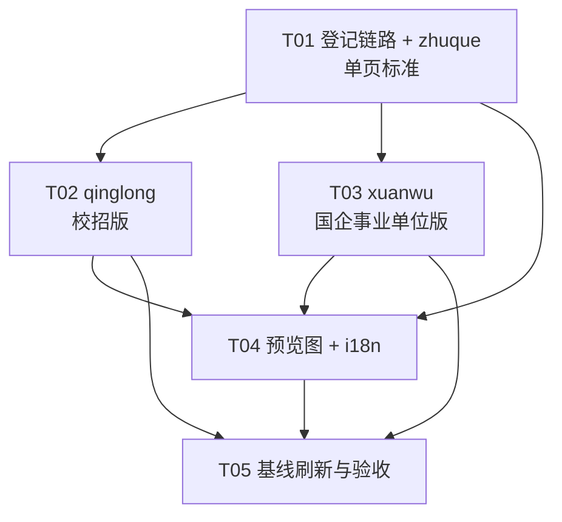
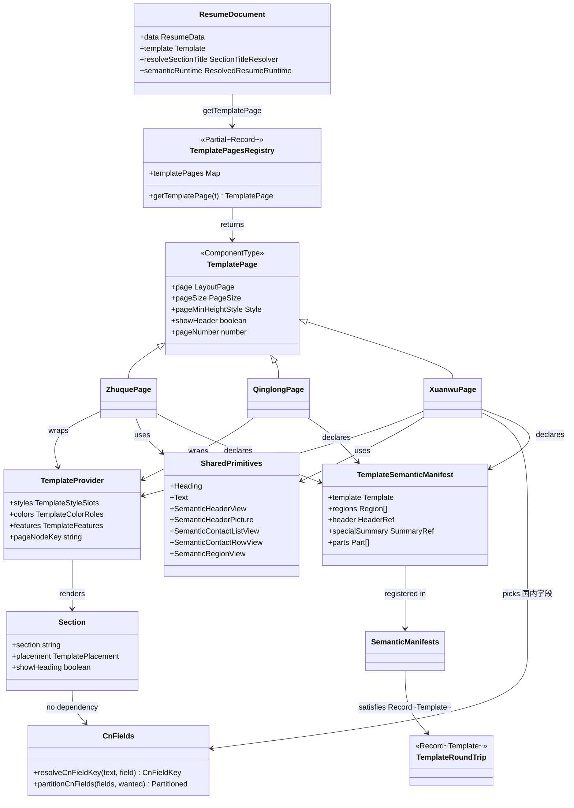
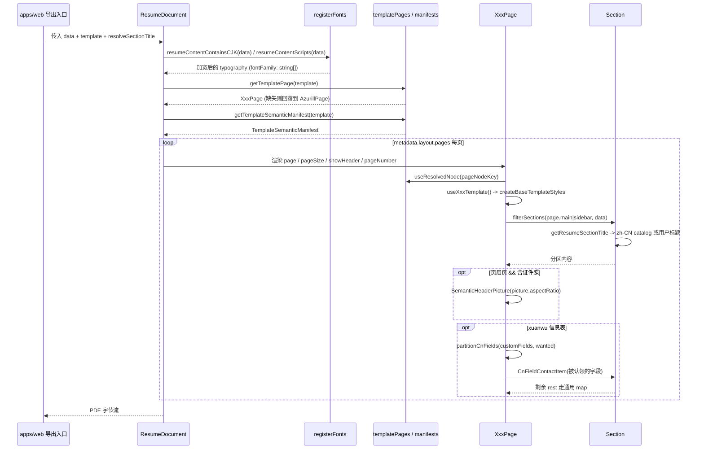

# 43 · 中文模板族(A1)—— 现有模板架构调研与新增落点设计

> 编制日期:2026-09-28 · 编制人:架构师 · 阶段:**调研 + 设计**,本次不写实现代码
> 上游:`plans/42-project-plan.md` §2.1(A1,4~6 天)、§4.5(PDF 基线)、§6(风险 4)
> 范围边界:只做 PDF 模板;不动 `packages/` 下任何文件,不创建模板源码

---

## 0. 结论先行

| 问题 | 结论 |
|---|---|
| 一套模板的最小组成 | **只有 2 个文件**:`<id>/<Id>Page.tsx` + `<id>/semantic.ts`。其余全是"登记"动作 |
| 加一套模板要动几处 | **至少 5 处源码登记 + 4 处测试/产物登记**(详见 §1.3 与 §1.9),其中 4 处由 `satisfies Record<Template,…>` 强制,漏改必红 |
| 是否要动 `section-title.ts` | **不要**。分区标题目录是生成物,已内置 zh-CN/zh-TW,模板只要走 `<Section>` 就自动吃到中文标题 |
| `packages/pdf` 里要不要 lingui | **不要**。该包零 `@lingui` 依赖;用户可见文案只在 `apps/web` 的模板元数据里 |
| 建议做哪几套 | 3 套必做(单页标准 / 校招版 / 国企事业单位版)+ 1 套建议本期砍掉(中英对照),理由见 §2.1 |
| 国内字段怎么识别 | **`key` 优先 + 前缀嗅探兜底**,一个 `cn-fields.ts` 助手同时适配 A2 前后;详见 §2.4 |
| 会不会弄脏 15 套基线 | **不会**,但前提是迁移后对照必须显式 `-t` 指定原 15 套。技术上为什么、违约会怎么炸,见 §5.1 |

---

## 1. 现有模板架构调研

### 1.1 一套模板由哪些文件组成

15 套结构完全一致。以 **kakuna(单栏最小集)** 与 **chikorita(双栏 + 背景色 sidebar)** 为例:

| 文件 | 职责 | 是否必需 |
|---|---|---|
| `packages/pdf/src/templates/<id>/<Id>Page.tsx` | 页组件。导出 `<Id>Page`,类型是 `TemplatePage`(见 `document.tsx:23`)。内含 Header 子组件 + `use<Id>Template()` 样式钩子 | 必需 |
| `packages/pdf/src/templates/<id>/semantic.ts` | 语义清单(Semantic Manifest)。导出 `<id>SemanticManifest`,声明 regions / header / parts | 必需 |
| `packages/pdf/src/templates/<id>/<Id>Page.test.tsx` | 模板专属测试。仅 ditgar / onyx / gengar / scizor 有,多为读源码的轻量断言 | 可选 |

`<Id>Page.tsx` 的固定骨架(以下六段,kakuna / chikorita / bronzor 逐字一致):

1. `type XxxStyles = Omit<TemplateStyleSlots, "page"> & { page: Style; … }` —— 模板私有的样式槽位类型。
2. `useXxxTemplate()` —— `useMemo(…, [picture, metadata, rtl])`,返回 `{ colors, styles }`。
3. 颜色三元组:`foreground / background / primary` 由 `rgbaStringToHex(metadata.design.colors.*)` 得到;双栏模板还会给 `sidebarForeground / sidebarBackground`。
4. `createBaseTemplateStyles({ metadata, foreground, background, r, metrics, picture })` —— 约 20 个共享槽位(text / heading / link / rich* / splitRow / picture …)一律从这里来,模板只在自己的 `StyleSheet.create` 里覆盖差异项。
5. 页面外壳:`<Page {...semanticPageProps} size={semanticPageSize ?? pageSize} style={composeStyles(styles.page, pageMinHeightStyle, semanticPageStyle)}>` → `<TemplateProvider pageNodeKey styles colors [features]>`。
6. 内容:`<SemanticRegionView region="main"|"sidebar">` 里用 `filterSections(page.main|page.sidebar, data)` + `useRenderedSectionIds` 过滤后 `map` 出 `<Section key={section} section={section} placement=… />`。

chikorita 额外有的、kakuna 没有的东西(即"复杂双栏"增量):

- 两个并列 `SemanticRegionView`,`flexBasis: ${metadata.layout.sidebarWidth}%`(默认 35)。
- `<PageMarginBackground color=… margin=… />` 做满出血色块。
- 槽位写成**函数形式** `text: (ctx) => ({…})`,按 `ctx.placement` 切换主/侧栏前景色(见 `TemplateStyleContext`)。
- `resolvePlacementColor` 做 placement 分支。

### 1.2 模板 파일 nesting 之外的共享层

`packages/pdf/src/templates/shared/` 是公共资产,新增模板**只消费、不复制**:

| 文件 | 提供什么 |
|---|---|
| `base-template-styles.ts` | ~20 个共享样式槽位工厂(注释明确写了"被全部 15 套逐字节共享") |
| `primitives.tsx` | `Div / Text / Heading / Link / Small / Bold / Icon / SemanticHeaderView / SemanticRegionView / SemanticContactListView / SemanticContactRowView / SemanticHeaderPicture / SemanticTemplatePartView / SectionHeadingIcon` |
| `sections.tsx` | `<Section>` 总入口(1572 行),内含 `SummarySection`…`ReferencesSection` 全部分区渲染器 |
| `contact-item.tsx` | `Email/Phone/Location/Website/CustomFieldContactItem` —— 国内字段要改的就是这里周边 |
| `filtering.ts` | `filterSections / isSectionVisible`,按 hidden 与主标题字段剔除空分区 |
| `metrics.ts` | `getTemplateMetrics` → padding / columnGap / sectionGap / gapX(f) / gapY(f) |
| `page-size.ts` | `getTemplatePageSize / getTemplatePageMinHeightStyle`(A4 = 595.28×841.89) |
| `rtl.ts` | `createRtlStyleHelpers` —— **必用**,`rtl-fixture.test.ts` 会查源码 |
| `types.ts` | `TemplateColorRoles / TemplateStyleSlots / TemplateFeatures` |
| `context.tsx` | `TemplateProvider` + `useTemplateStyle / useTemplateFeature / useTemplateIconSlot` |

可用的 `TemplateFeatures`(决定线条 overwhelmingly 版式密度):

| feature | 谁在用 | 作用 |
|---|---|---|
| `inlineItemHeader` | meowth | 「职位 · 单位 · 时间」压成一行 —— **正是亚洲简历习惯**,校招版直接复用 |
| `stackSidebarItemHeader` | ditgar / glalie / pikachu | 侧栏条目头上下堆叠 |
| `sectionTimeline` | azurill | 时间线装饰 |
| `skillLevelAfterName` | gengar | 技能等级跟在名字后 |

### 1.3 模板如何注册(全部登记点)

| # | 文件 | 改动 | 漏改后果 |
|---|---|---|---|
| 1 | `packages/schema/src/templates.ts` | `z.enum([…])` 增加 id | 后续所有 `Record<Template,…>` 收不到它(不算出错,但模板不存在) |
| 2 | `packages/pdf/src/templates/index.ts` | `import` + `templatePages` 增加一条 | **静默**:`getTemplatePage` 有 `?? AzurillPage` 兜底(`index.ts:37-39`),会渲染成别人的版式 |
| 3 | `packages/pdf/src/semantic/template-manifest.ts` | `import` + `TEMPLATE_SEMANTIC_MANIFESTS` 增加一条 | **typecheck 红**(第 320 行 `satisfies Readonly<Record<Template, TemplateSemanticManifest>>`) |
| 4 | `packages/docx/src/builder.ts` | `TEMPLATE_CONFIGS` 增加一条 | **typecheck 红**(第 70 行 `Record<Template, TemplateConfig>`)—— 这一处团队容易漏 |
| 5 | `apps/web/src/dialogs/resume/template/data.ts` | `templates` 增加元数据 | **typecheck 红**(第 119 行 `satisfies Record<Template, TemplateMetadata>`) |
| 6 | `apps/web/public/templates/jpg/<id>.jpg` | 新增预览图 | 不报错,但首页 `template-shelf.tsx` 会对**每个** schema id 渲染 `/templates/jpg/${item}.jpg` → 缺图会让整排轮播出现破图 |

关于第 6 点的顺序:现有 enum 是**按字母排序**的。中文模板建议**追加在末尾成块**,理由是 `templateSchema.options` 直接决定首页轮播顺序与 gallery 遍历顺序,追加不会打乱已验收的 15 套展示次序。代价:enum 不再严格字母序。这是一处需要 PM 确认的取舍。

### 1.4 预览图资源

- 位置:`apps/web/public/templates/jpg/<id>.jpg` 与 `apps/web/public/templates/pdf/<id>.pdf`。命名规则 = **与模板 id 完全一致的小写名**,无前缀无版本号。
- 是否必须:jpg **事实上必须**(首页对每个 schema id 拼路径);pdf 目前只被 web 端少数场景引用(如 `ats-checker/parse-preview.tsx` 写死 `onyx`),对新模板不强求,但建议补齐保持对称。
- 现有尺寸不一致:多数是 **510×720**(A4 比例);`meowth.jpg` 是 31245×6613(约 976 KB),`scizor.jpg` 是 800×1132。**新模板统一 510×720** —— 与 `template-shelf.tsx` 的 `aspect-[510/720] width=510 height=720` 对齐。
- **仓库里没有生成预览图的脚本**(全仓 grep `templates/jpg` 在非 web 位置零命中)。可用积木见 §5.3。

### 1.5 分区标题如何解析(重要:新模板不需要动它)

链路:`<Section>` → `SectionShell`(`shared/sections.tsx:319`)调用 `getResumeSectionTitle(data, sectionId, title)` → `packages/pdf/src/section-title.ts`:

1. `data.summary/sections[id]/customSections` 上用户填的 `title` 非空 → 直接用(**用户优先**)。
2. 否则走 `data.resolveSectionTitle`(由 `apps/web/src/features/resume/export/use-resume-export.ts` 注入)。
3. 兜底 `defaultSectionTitleResolver`:查 `section-title-catalog.json[locale][defaultEnglishTitle]`。

关键事实:

- **`section-title-catalog.json` 是生成物**,由 `pnpm pdf:translations`(`tooling/locales/generate.ts`)从 `apps/web/locales/*.po` 产出,并有测试断言"已提交 === 已生成"。**不得手改**(AGENTS.md 亦写明)。
- **zh-CN 映射已存在**:Summary→总结、Experience→工作经历、Education→教育经历、Profiles→个人资料、Skills→技能、Certifications→证书 等 13 条;zh-TW 也有。
- **默认简历区域已经是 zh-CN**:`defaultResumeData.metadata.page.locale === "zh-CN"`。

⇒ **结论**:新增模板只要用 `<Section>` 渲染分区,分区标题天然是中文,不需要改 `section-title.ts` / catalog。唯一的反模式是模板自己 hardcode 标题字符串 —— 那会绕过翻译,且 `packages/pdf` 没有 lingui,属于**禁止**。

### 1.6 语义层需要登记什么

`packages/pdf/src/semantic/template-manifest.ts` 是一套带自校验的契约:

- 清单结构:`{ template, regions[], header, specialSummary, parts[] }`,外加可选 `skillLevelAfterName` / `canonicalBindings`。
- `template-manifest.ts:322` 对所有清单跑 `validateTemplateSemanticManifestShape`(区域名/参与/parent 路由深度 ≤1/无环/owner 自洽…)。
- **关键**:`packages/resume/src/stylesheet/registry/semantic.ts:183` 的 `templatePartChildKinds` 是一张**静态表**,列举了所有合法的 part 名 → 子 kind。已登记的名字包括:
  `timeline-*`、`featured-summary`、`sidebar-background`、`header-band`、`picture-anchor`、`contact-offset`、`header-intro`、`header-body`、`header-contact-band`、`header-divider`、`header-name-rule`、`contact-item-content`、`contact-row-primary`、`contact-row-secondary`、`item-header-row`、`inline-item-header-leading/middle/trailing`、`education-grade-row`。
- ⇒ **新模板若想零改动 `packages/resume`,就必须只复用上表已存在的 part 名。** 最小可用清单就是 kakuna/lapras/onyx 那种:`regions = header/main/sidebar` + `parts = [itemHeaderRowPart]`(`itemHeaderRowPart` 由 `semantic/shared-parts.ts` 导出并必带)。

### 1.7 i18n

- `packages/pdf` 全包 grep `@lingui` / `msg\`` **零命中**。模板 Page.tsx 里出现待翻译文案是没有出口的。
- 模板唯一的用户可见文案:`apps/web/src/dialogs/resume/template/data.ts` 的 `description: msg\`…\`` 与 `tags`。
- 新增/修改后必须跑 `pnpm --filter web lingui:extract`(会连带 `pnpm pdf:translations`),再补 `apps/web/locales/{zh-CN,zh-TW}.po`。
- **命名硬约束**(`data.test.ts`):`id` 必须全小写 ASCII,且 `meta.name.toLowerCase() === id`。⇒ 模板名**不能是中文**;中文语义只能进 `description` 与 `tags`。

### 1.8 渲染管线(模板之外的部分)

渲染管线(`packages/pdf/src/document.tsx`):

1. `getTemplatePage(template)` 取页组件(缺失 → AzurillPage)。
2. `resumeContentContainsCJK(data)` / `resumeContentScripts(data)` 扫 CJK/脚本。
3. `registerFonts(typography, locale, hasCjk, scripts)` 得到**可能被加宽成 `string[]`** 的字体族。
4. `resolveResumeRuntime({data, template, mode})` 建语义树 → `SemanticRenderProvider` → `RenderProvider`。
5. `<Document>` 按 `metadata.layout.pages[]` 逐页渲染 `<TemplatePageComponent>`,`showHeader={index === 0}`。

⇒ **模板组件不直接读 pages 循环**,分页是 document 层 + react-pdf 自动分页的。

### 1.9 会让 CI 变红的既有测试 / 产物(务必逐条处理)

| 位置 | 为什么红 | 怎么处理 |
|---|---|---|
| `packages/pdf/src/semantic/template-manifest.test.ts` | `EXPECTED_PARTS`(第 40 / 319 行)与 `EXPECTED_LAYOUT`(第 321 / 457 行)都是 `satisfies Readonly<Record<Template, …>>` | **必须**为新模板各补一条;照抄 kakuna(最小集)或 meowth(齐行头部)结构即可 |
| `packages/pdf/src/templates/shared/date-layout.test.tsx` | `expectedMissingMarkers`(第 77 行)`satisfies Record<Template, readonly DateMarker[]>` | 必须补一条;通常补空数组 `[]` 即可(仅 meowth 因齐行头部吞掉了 `EXP_NO_PERIOD` 而填了非空值) |
| `packages/pdf/test-artifacts/date-layout/all-templates.json` | 用例"records default date evidence for every template"拿它与 `templates` 全量迭代结果做 `toEqual` | **测试会 FAIL**,必须用 `DATE_LAYOUT_ARTIFACT_DIR=<dir>` 重生成后拷回该目录 |
| `packages/pdf/src/semantic/__snapshots__/all-templates-presentation.test.ts.snap` | `it.each(templateSchema.options)` 快照 | 跑 `vitest -u` 补 3 条新快照(该文件现有 15 条约 9900 行) |
| `apps/web/src/dialogs/resume/template/data.test.ts` | 第 9-27 行**写死**了 15 个 id 数组 | 必须补 3 个 |
| `packages/pdf/src/rtl-fixture.test.ts` | `templateSchema.options.map` 自动覆盖,不用补条目 | 但会**读源码**校验:文件名必须是 `<Capitalized(id)>Page.tsx`;源码须含 `createRtlStyleHelpers`;须含 `alignEnd` 或 `createBaseTemplateStyles`;`不得`含 `alignRight`;`不得` import `@reactive-resume/utils/locale` |
| `packages/pdf/src/semantic/all-templates-smoke.test.tsx` / `no-wrapper.test.tsx` / `item-header-binding.test.tsx` | `it.each(templateSchema.options)` 自动覆盖 | 不用改,但新模板必须自己跑过(no-wrapper 会比对同一模板 legacy / semantic 两种模式的渲染树完全一致) |

**不需要动**(自动跟随 schema 枚举):`packages/resume/src/stylesheet/registry/semantic.ts` 的 `attributeValues.template`(及其测试)、`packages/pdf/src/section-title*.ts`、turbo boundaries(无新依赖)。

---

## 2. 新增中文模板的落点设计

### 2.1 选哪几套,以及取舍

| 序号 | 目录名(id) | 展示名 | 定位 | 优先级 | 取舍理由 |
|---|---|---|---|---|---|
| 1 | `zhuque` | Zhuque | **单页标准** | P0 | 国内社招网申的默认心智是"一页搞定"。与现有 lapras / kakuna 最接近(单栏 + 模块间距紧凑),投入产出比最高,且不需要任何新 part,是验证整条登记链路的最佳第一套 |
| 2 | `qinglong` | Qinglong | **校招版** | P0 | 应届生内容天然短,靠"版式密度"取胜。可直接复用 meowth 已登记的 `inline-item-header-*` + `education-grade-row` 把「专业 · 学校 · 时间」「成绩/排名 · 地点」压成单行 —— **零 `packages/resume` 改动**就能拿到 compact 亚洲版式 |
| 3 | `xuanwu` | Xuanwu | **国企 / 事业单位版** | P0 | 信息密度最高、国内字段最多(证件照 / 政治面貌 / 民族 / 出生年月),是唯一能体现"国产化"的一张脸。也是必须回答 §2.4 的那套 |
| 4 | `baihu` | Baihu | 中英对照版 | **P2,建议本期不做** | 见下方"为什么砍" |

**为什么建议砍掉第 4 套**:现有 schema 里一份简历只有一套数据,**不存在中英双字段**,真双语简历在数据层做不到。唯一可行的是"分区标题中文 + 英文副标题",而这需要动 `shared/sections.tsx` 的 `SectionShell` 给模板注入副标题 —— `SectionShell` 被 15 套共用,改它会直接威胁 §5.1 的"PDF 输出不变"硬验收。**停止条件**:若团队坚持做,必须先评估共享改动,且不得在本任务里动 `shared/sections.tsx`。若确有需要,建议改为更便宜的第 4 套:一个"表格履历版"(仍走现有 Section,只换 Chrome 与密度)。

### 2.2 命名约定(三处联动,缺一处就红)

```
id : 小写 ASCII,不能有中文 → "zhuque"
目录: packages/pdf/src/templates/zhuque/
文件: ZhuquePage.tsx        ← rtl-fixture.test.ts 按 capitalize(id) 拼路径
导出: export const ZhuquePage
清单: export const zhuqueSemanticManifest
元数据: name: "Zhuque"      ← data.test.ts 断言 name.toLowerCase() === id
预览: public/templates/{jpg/zhuque.jpg, pdf/zhuque.pdf}
```

### 2.3 每套的文件清单与版式要点

#### 通用:三套共用的新增文件

| 路径 | 说明 |
|---|---|
| `packages/pdf/src/templates/shared/cn-fields.ts` | **新增**。国内字段识别助手(§2.4)。放 shared 而不是单个模板目录,是因为 ≥3 套模板都要用(AGENTS.md:「模板专属的视觉例外留在所属模板目录,除非多个模板都需要该行为」) |
| `packages/pdf/src/templates/shared/cn-fields.test.ts` | **新增**。覆盖嗅探命中 / 未命中 / `key` 优先 / 重复值只消费一次 |
| `tooling/scripts/template-preview.ts` | **新增(建议)**。预览图生成脚本(§5.3)。`tooling/` 不是 `packages/`,允许新增 |

#### 第 1 套 · `zhuque` 单页标准

新增:`templates/zhuque/ZhuquePage.tsx`、`templates/zhuque/semantic.ts`

版式要点:

- **单栏为主**。`page.fullWidth === true` 时只渲染 main 区;否则退化为"主区 + 右侧窄栏",**不加背景色块**(与 chikorita 区分),侧栏只用一条 1px 主色竖线分隔。
- 页眉:**姓名居左**(heading ×1.5)+ 右侧**竖版证件照**。证件照位用 `picture.size` 作高、宽 = `size × picture.aspectRatio`(国内一寸照≈0.73,二寸≈0.79);`aspectRatio` 默认 1,`pictureSchema` 允许 0.5~2.5,**无需改 schema**。
- 姓名下方:一整条 `SemanticContactListView` 横排联系方式(现有 Email/Phone/Location/Website + 全部 customFields),与 bronzor 的居中头部形成明显差异。
- 分区标题:左对齐 + 主色 1px 下边框,**不做大写转换**(区别于 scizor)。
- 语义清单:**最小集**(regions header/main/sidebar + `parts: [itemHeaderRowPart]`),与 kakuna 完全一致 ⇒ `EXPECTED_PARTS` / `EXPECTED_LAYOUT` 直接照抄 kakuna 条目。
- `TemplateFeatures`:不开启任何 feature(保持 `%s` 与 `features` 干净)。

#### `qinglong` 校招版

新增:`templates/qinglong/QinglongPage.tsx`、`templates/qinglong/semantic.ts`

版式要点:

- 单栏全宽;页眉偏左 + 证件照右侧(比 zhuque 留白更大、`typography.heading.fontSize` 倍率更小)。
- **紧凑行**:`features: { inlineItemHeader: true }`,语义清单**整体照抄 meowth 的 parts**(`itemHeaderRowPart` + `inline-item-header-leading/middle/trailing` + `education-grade-row`),这些 part 名已在 `templatePartChildKinds` 里 ⇒ 不动 `packages/resume`。
- 「教育经历」优先:模板**无权**给分区排序(顺序来自 `metadata.layout.pages[].main`),见 §5.4。校招版的"突出教育"需要靠 A4 分区预设或用户拖拽;本套只保证教育区块的渲染密度对得起它的位置。
- 校园经历/社团/竞赛:走 customSections,由 `<Section>` 通用渲染,**模板不特判**。
- `TemplateFeatures`:`inlineItemHeader: true`。

#### `xuanwu` 国企 / 事业单位版

新增:`templates/xuanwu/XuanwuPage.tsx`、`templates/xuanwu/semantic.ts`、`templates/xuanwu/XuanwuPage.test.tsx`

版式要点:

- 页眉 = **个人信息横条**:姓名独占一行(居中或居左),下方一张两列多行信息表 —— 左列「性别 / 民族 / 政治面貌 / 出生年月 / 籍贯 / 学历」,右列可能被证件照占用。
- 证件照位**竖版强制**:宽度固定为高度的 0.75 倍(一寸照比例),`objectFit: picture.fit`。
- 正文:单栏时间倒序(数据顺序,见 §5.4),「工作经历」在「教育经历」之前是用户数据的责任。
- 语义清单:**最小集**(regions header/main/sidebar + `parts: [itemHeaderRowPart]`)。说明:虽然可以用 chikorita 的 `contact-row-primary/secondary` 做"标准字段一行、剩余一行"的粗分组,但 part route 的 `take` 无法按单个 customField 路由(它把 `name: "custom"` 作为一个整体搬运),**做不到"政治面貌单独一格"**。因此信息表的分组能力完全由模板样式 + `cn-fields.ts` 提供,语义层保持最小 —— 也是最省事、最不容易踩 §1.9 的路径。
- `TemplateFeatures`:不开启。
- 兜底行为:若一个国内字段都没识别出来,信息表退化为「姓名 / 电话 / 邮箱」三格 —— **不空、不崩、不与现有 15 套产生差异**。

### 2.4 关键问题:国内字段如何识别

#### 现状(已核实)

- `customFieldSchema`(`packages/schema/src/resume/data.ts:83`)只有 `{ id, icon, text, link }`;`id` 是随机 ULID 无语义,`icon` 是 Phosphor 名且用户随意填,`link` 是 URL。**唯一有信息量的是 `text`,且它是自由文本**。
- 15 套模板无一例外都是 `basics.customFields.map(field => <CustomFieldContactItem key={field.id} … />)` —— **无差别全渲染**(唯一例外是 rhyhorn,它把 contacts 收进一个数组按 index 标尾项,语义等价)。
- 语义节点 key 是 `contactItem(contactListKey, "custom", field.id)`。

⇒ 只靠 `text` 能识别到什么程度?国内用户填 customField 的日常写法就是「政治面貌:中共党员」「民族:汉族」—— **标签在冒号左边**,这正是可以利用的稳定结构。

#### 建议方案三层(本期只需实现第 0 层)

**第 0 层 —— `key` 优先 + 前缀嗅探兜底(现在就能写,零 schema 改动)**

新增 `packages/pdf/src/templates/shared/cn-fields.ts`:

```
export type CnFieldKey =
  | "gender" | "birthDate" | "ethnicity" | "politicalStatus"
  | "nativePlace" | "hukou" | "maritalStatus" | "height";

const CN_FIELD_LABELS: Record<CnFieldKey, readonly string[]> = {
  politicalStatus: ["政治面貌", "政治面目"],
  ethnicity: ["民族", "族别"],
  birthDate: ["出生年月", "出生日期", "生日"],
  gender: ["性别"],
  nativePlace: ["籍贯"],
  hukou: ["户籍", "户口所在地"],
  maritalStatus: ["婚姻状况"],
  height: ["身高"],
};

// 解析顺序:A2 的 key > 文本前缀嗅探
export const resolveCnFieldKey = (field: CustomField): CnFieldKey | undefined => { ... };

export const partitionCnFields = (fields: CustomField[], wanted: readonly CnFieldKey[]): {
  slots: Partial<Record<CnFieldKey, CustomField>>;
  rest: CustomField[];
} => { ... };
```

解析算法(纯字符串,不碰 schema):

1. `resolveCnFieldKey` 先读 `(field as { key?: string }).key` —— **A2 落地当天即生效,模板代码一行不改**。
2. 取不到再嗅探:以**全角 `:` 优先、半角 `:` 兜底**切前缀;`trim()` 后去掉普通空格与全角空格 U+3000;与 `CN_FIELD_LABELS` 比对(中文无视大小写)。
3. 命中即被**认领**,`partitionCnFields` 把它从 `rest` 里剔除 ⇒ **不会被渲染两次**(这是对现有"无差别全渲染"唯一的破坏性改变,且只发生在命中的字段上)。
4. 嗅探失败 ⇒ 该字段留在 `rest`,行为与现有 15 套**逐字节一致**。

配套:`CnFieldContactItem`(建议加在 `shared/contact-item.tsx` 里,**纯新增导出、不改现有导出**),渲染成「标签:值」两截而不是 Icon+文本。放在 contact-item.tsx 内是为了复用 `useContactNodeKeys`,保证语义 key 不受影响。

**第 1 层 —— A2 落地后:A2 加可选 `key`,`packages/pdf` 只需对齐取值空间**

- `resolveCnFieldKey` 第一行已经是 `key ?? sniff(text)`,**无需任何代码返工**。
- **唯一风险**:A2 决定的 `key` 取值字符串必须与 `CnFieldKey` 一致,否则会**无声降级**到嗅探(不报错、功能悄悄失灵)。⇒ 这是 §5 待明确事项里的**最高优先级**协同项,必须在 A2 动工前定值。

**第 2 层 —— 若 A2 同时决定加 `label` / `value` 拆分**:`CnFieldContactItem` 优先用 `label`/`value`,回落 `text`。同样是新增分支,不影响现有 15 套。

#### 明确放弃的选项(含理由)

| 方案 | 为什么不做 |
|---|---|
| 用 `field.icon` 识别 | 图标是 Phosphor 任意名,用户可以选任何图标,零稳定性 |
| 用数组顺序识别 | 用户会拖拽重排 customFields,必炸且难复现 |
| 用 `field.id` 识别 | ULID 随机生成,无语义 |
| 模板里 hardcode「政治面貌」标签 | `packages/pdf` **没有 lingui**,违反"模板内不出现待翻译文案"约束;且会绕过 §1.5 的翻译链路 |
| 现在就等 A2 | A1 是门面功能排在最前,而 §2.4 第 0 层让两者**完全解耦**,没必要串行 |

#### A2 未落地时 xuanwu 怎么上线(过渡方案)

1. 信息表**只渲染认得出来的字段**;认不出就不进表,全部落到通用 customFields 行。
2. 若一个都没认出 ⇒ 退化为「姓名 / 电话 / 邮箱」三格,不空不崩。
3. 「引导用户按 `标签:值` 填写」这件事,由 A2 的前端表单承担(或仅写进使用说明)。**归属待明确**,见 §5.6。

---

## 3. 任务分解

### 3.1 任务列表(按依赖顺序)

| ID | 任务 | 源文件 | 依赖 | 优先级 | 工作量 |
|---|---|---|---|---|---|
| T01 | **登记链路打通 + 单页标准 `zhuque`** | 新增:`zhuque/ZhuquePage.tsx`、`zhuque/semantic.ts`、`shared/cn-fields.ts`、`shared/cn-fields.test.ts`;<br>修改:`schema/src/templates.ts`、`pdf/src/templates/index.ts`、`semantic/template-manifest.ts`、`docx/src/builder.ts`、`web/dialogs/resume/template/data.ts`、`semantic/template-manifest.test.ts`、`templates/shared/date-layout.test.tsx` | 无 | P0 | 1.5 天 |
| T02 | **校招版 `qinglong`** | 新增:`qinglong/QinglongPage.tsx`、`qinglong/semantic.ts`;<br>修改:T01 的 7 个修改点各 +1 条 | T01 | P0 | 1 天 |
| T03 | **国企事业单位版 `xuanwu`** | 新增:`xuanwu/XuanwuPage.tsx`、`xuanwu/semantic.ts`、`xuanwu/XuanwuPage.test.tsx`;<br>修改:T01 的 7 个修改点各 +1 条;`shared/contact-item.tsx`(纯新增 `CnFieldContactItem` 导出) | T01 | P0 | 1.5 天 |
| T04 | **预览图与 i18n** | 新增:`public/templates/jpg/{zhuque,qinglong,xuanwu}.jpg`、`public/templates/pdf/{zhuque,qinglong,xuanwu}.pdf`、`tooling/scripts/template-preview.ts`;<br>修改:`web/dialogs/resume/template/data.test.ts`、`web/locales/{en-US,zh-CN,zh-TW}.po`、`web/dialogs/resume/template/data.ts`(description/tags 定稿) | T01, T02, T03 | P1 | 0.5~1 天 |
| T05 | **测试基线刷新与验收** | 修改:`semantic/__snapshots__/all-templates-presentation.test.ts.snap`、`pdf/test-artifacts/date-layout/all-templates.json`;<br>产出:15 套基线未受影响的证据 + typecheck/test/boundaries 全绿 | T02, T03, T04 | P0 | 0.5 天 |

合计 **4.5~5.5 天**,落在 42 号方案给 A1 的 4~6 天区间内。`baihu`(中英对照)若做,需先单独评估 `shared/sections.tsx` 的改动,**不计入本表**。

### 3.2 任务依赖图



### 3.3 每套模板的工作量拆解

| 环节 | zhuque | qinglong | xuanwu |
|---|---|---|---|
| Page.tsx 骨架 + 样式钩子 | 0.5 天 | 0.3 天(复用 zhuque 骨架) | 0.4 天 |
| 版式调参(间距/栏宽/证件照) | 0.3 天 | 0.2 天 | 0.6 天(信息表最复杂) |
| semantic.ts + 测试表登记 | 0.2 天 | 0.3 天(抄 meowth 的 parts) | 0.2 天 |
| 预览图生成 | 计入 T04 | 计入 T04 | 计入 T04 |
| 联调与像素自查 | 0.5 天 | 0.2 天 | 0.3 天 |

---

## 4. 共享约定(跨文件必须遵守)

1. **三处登记必须同批提交**:`schema/src/templates.ts` → `pdf/src/templates/index.ts` → `semantic/template-manifest.ts`。`Record<Template,…>` 的 `satisfies` 会让漏登记在 **typecheck** 阶段就炸 —— 这是好事,靠它兜底。
2. **文件名铁律**:目录 = 小写 id;文件名 = `<Capitalized(id)>Page.tsx`(`rtl-fixture.test.ts` 按此拼路径读源码)。
3. **id 铁律**:全小写 ASCII;元数据 `name` 必须与 id 大小写一致(`name.toLowerCase() === id`)⇒ **名字不能是中文**;中文语义进 `description` 与 `tags`。
4. **语义清单只复用已有 part 名**。三套 v1:`zhuque` / `xuanwu` 取最小集(`itemHeaderRowPart`),`qinglong` 照抄 meowth 的 parts。新增 part 名意味着同时改 `packages/resume/src/stylesheet/registry/semantic.ts` —— 本期不做。
5. **样式一律从 `createBaseTemplateStyles` 起步**,不重造那 ~20 个共享槽位;差异只写在自家 `StyleSheet.create` 里。
6. **RTL 铁律**:必用 `createRtlStyleHelpers(rtl)`;源码不得出现 `alignRight`;不得在 `packages/pdf` 里 import `@reactive-resume/utils/locale`。
7. **自定义字段必须仍在 `SemanticContactListView` 内渲染**,只做视觉重排/分格,不改变语义树 ⇒ 规避 §1.9 里那一串昂贵的联动。
8. **模板零待翻译字符串**:全部走 `Section` 的 `getResumeSectionTitle`;新增文案只在 `data.ts` 的 `msg` 里,改完跑 `pnpm --filter web lingui:extract`。
9. **不得手改** `packages/pdf/src/section-title.ts`、`section-title-catalog.json`(生成物)、`apps/web/src/routeTree.gen.ts`。
10. **预览图统一 510×720 JPEG**,`/templates/jpg/<id>.jpg` + `/templates/pdf/<id>.pdf`。
11. **每套模板至少自带一个测试**(哪怕是 scizor 那种读源码断言),用来证明它被 `getTemplatePage` 真正选中过。

---

## 5. 风险与待明确事项

### 5.1 新增模板会不会弄脏已验收的 15 套 PDF 基线

**不会 —— 但前提是一条操作纪律,而且违约必炸。**

看代码事实(`tooling/scripts/pdf-baseline.ts`):

- 第 323 行:`templates: requestedTemplates.length > 0 ? … : [...templateSchema.options]`。⇒ **schema 枚举一旦变大,默认全量快照的输出集会同步变大**。不带 `-t` 直接重跑,会在输出目录里多出 3 个 PDF,并把它们写进 `manifest.json`。
- 第 407 行:`knownTemplates = new Set(templateSchema.options)` → 清理"已不存在"的旧条目。新模板加入 schema 后,旧 15 条不会被判为 stale,**保留**。
- 第 549-553 行:`compareBaselines` 二轮遍历 —— RIGHT(迁移后)里比 LEFT(迁移前)多出的模板会被判 `missing in left baseline`,**status = fail,exit 1**。LEFT 多出同理。

⇒ **约定如何在技术上保证**(写进验收清单):

1. `tooling/baseline/pre-migration/` 是 **git 跟踪的只读对照物**,**永远不要往这个目录写**;迁移后要重跑基线,一律输出到**新目录**(`-o`),从不覆盖 pre-migration。
2. 迁移后对照**必须显式带 `-t`**,列出原始 15 套:
   `azurill,bronzor,chikorita,ditgar,ditto,gengar,glalie,kakuna,lapras,leafish,meowth,onyx,pikachu,rhyhorn,scizor`
3. 15 套自己的版式在这个任务里**一行未改**,所以 `-t` 筛出来的这批 PDF 应与 pre-migration 逐页 `differingPixels=0, maxChannelDelta=0`。
4. 额外加固(建议放 T05 做,不必需):给 `pdf-baseline.ts` 加 `--exclude <names>` 或 `--legacy-only`。`tooling/` 不属于"不得改动"的范围,可以改;不改也能达成目标。
5. 验收判据仍是 42 号 §4.5 的**像素对比**,不要拿 manifest.json 做文本 diff(`generatedAt` 每次都会变)。

### 5.2 中文字体:CJK 回退怎么工作,会不会拖慢导出

链路(`packages/pdf/src/hooks/use-register-fonts.ts`):

1. `document.tsx` 拿 `resumeContentContainsCJK(data)`(cjk-regex 扫 basics/summary/sections/customSections)与 `resumeContentScripts(data)` 调 `registerFonts`。
2. `getPdfFallbackFontFamilies(bodyFamily, {locale, scripts})`:`zh-CN` → `getLocaleScript` 得 `han-simplified` → 按 category 取 `Noto Sans SC`(sans)或 `Noto Serif SC`(serif);再附一个标点兜底 `Noto Sans`。
3. `registerFallbacks` 对每个回退族注册 `{bodyRange.lowest, bodyRange.highest, headingRange.lowest, headingRange.highest} ∪ {resolveBoldFontWeight(family, bodyWeights)}` 个权重,且 **normal / italic 各一遍**。

按本仓库默认排版实测推算(body = IBM Plex Serif `["400","500"]`,heading = `["600"]`,Noto Sans SC 全字重均有、`resolveBoldFontWeight` 返回 `"700"`):回退族会被注册 **约 4 个权重 × 2 种 style = 8 次**;其中 italic 没有对应文件时 `getWebFontSource` 会回落到同一个 upright URL。

**体积**:42 号 §6.1 实测 `Noto Sans SC` 400 单个 TTF ≈ 10,559,284 字节(≈10.1 MiB),且 400/500/600/700 是**四个不同 URL**(见 `packages/fonts/src/webfontlist.json`)。⇒ 首次渲染可能要拉 **≈40 MiB** 量级的字形数据。

必须分清这是谁的锅:

- **这不是 A1 引入的**,而是"任何含中文的简历在今天就已经付这笔钱"。中文模板只是让这条路径被更频繁地走到。
- **A1 的边界**:模板里**不得**出现任何字体注册/选型逻辑,只用 `metadata.typography.body/heading.fontFamily`(已被 `registerFonts` 加宽为 `string | string[]`)。**不要**为了"让中文更好看"而在模板里追加 heavier 字重注册。
- **治理归属 A3(中文字体取字通道)**,不在 A1 范围。
- **另一个坑**:`webfontlist.json` 指向 `fonts.gstatic.com`。离线/无网环境下 CJK 回退注册会失败 —— 这会**直接影响 T04 的预览图生成**,见下。
- A1 验收时建议记录"首次渲染 vs 后续渲染"耗时差,作为给 A3 的输入数据。

### 5.3 预览图怎么生成

**没有现成脚本**(已核实)。可用的三块积木正好凑齐:

1. `tooling/scripts/pdf-baseline.ts:336` —— `createResumePdfFile({data, filename, template})`(来自 `@reactive-resume/pdf/server`)。这就是 `public/templates/pdf/<id>.pdf` 的来源。
2. `packages/pdf/src/semantic/test/rasterize-pdf.ts` —— pdfjs-dist + `@napi-rs/canvas` 光栅化(scale 参数可算)。
3. `@napi-rs/canvas` 的 canvas 可直接导出 JPEG(`encode("jpeg", q)` / `toBuffer("image/jpeg")`)。仓库里 `fast-png` 只能出 PNG,不适合做预览图(体积大)。

⇒ 建议新增 `tooling/scripts/template-preview.ts`(非 `packages/`,允许新增):渲染 → 取第 1 页 → 按目标宽 510 反算 scale → canvas → JPEG quality ≈ 0.8 → 写盘。

两个待定:

- **数据源**:`sampleResumeData` 是英文示例(David Kowalski),用它做中文模板的预览图没有说服力。建议脚本支持 `--fixture` 传入中文样例数据。**样例数据放哪(临时文件?新增 fixture?)需要 PM 定**。
- **网络**:见 §5.2 —— 生成环境必须能访问 `fonts.gstatic.com`,否则字体回落失败。

### 5.4 时间倒序:模板做不到

`packages/resume/src/section-sort.ts` 有现成的 `sortSectionItemsByPeriod`(倒序,含 ongoing 优先),但全仓 grep 确认**它只被自己的测试调用**,没有任何产品线接它的输出(包括 `packages/pdf`)。

⇒ 「时间倒序」「校招时把教育经历放前面」都属于**用户数据的顺序**(`metadata.layout.pages[].main` 数组 + 条目数组),**模板无权重排**。三个出口:

1. A4「国内分区预设」给出符合国内习惯的默认 page layout(推荐);
2. 只在文档/UI 提示里引导用户按倒序拖拽;
3. (超出 A1)把 `sortSectionItemsByPeriod` 接到 PDF 渲染前 —— 这会改变所有 15 套的输出,**本期禁止**。

### 5.5 容易被忽略的炸点

`date-layout.test.tsx` 与 `all-templates-presentation.test.ts.snap`(§1.9)。它们不会在 typecheck 阶段拦人,只会在**测试运行时**红,而且红的位置看起来"跟模板无关"。T05 就是专门为了它们而存在的。

### 5.6 待明确事项(需 PM / A2 负责人拍板)

1. **`customField.key` 的取值空间**:必须与 `cn-fields.ts` 的 `CnFieldKey` 字面量一致,否则 A2 落地后会**无声降级**到嗅探。这是 A1✕A2 唯一的硬耦合点,建议 A2 动工前一天对齐。**(最高优先级)**
2. **enum 顺序**:新模板追加在末尾(不打乱已验收 15 套的轮播顺序,代价是失去字母序),还是插入字母序。
3. **是否做第 4 套**:`baihu` 中英对照需要改 `shared/sections.tsx`,建议本期砍掉或换成"表格履历版"。
4. **`标签:值` 的填写引导**归谁 A2 前端表单?还是只有文档?
5. **预览图样例数据**:是否新增一份中文 fixture、放在哪。
6. **是否给 `pdf-baseline.ts` 加 `--exclude` / `--legacy-only` 开关**(§5.1 第 4 条)。
7. **xuanwu 的信息表字段清单**:除「性别 / 民族 / 政治面貌 / 出生年月 / 籍贯」外是否还要「婚姻状况 / 身高 / 户籍」—— 后者偏敏感,建议不做(与 42 号 §2.3 "实名认证等高敏环节本期不做"的精神一致)。

---

## 附录 A · 现有模板组件关系(classDiagram)



## 附录 B · 一次导出调用的时序(sequenceDiagram)


