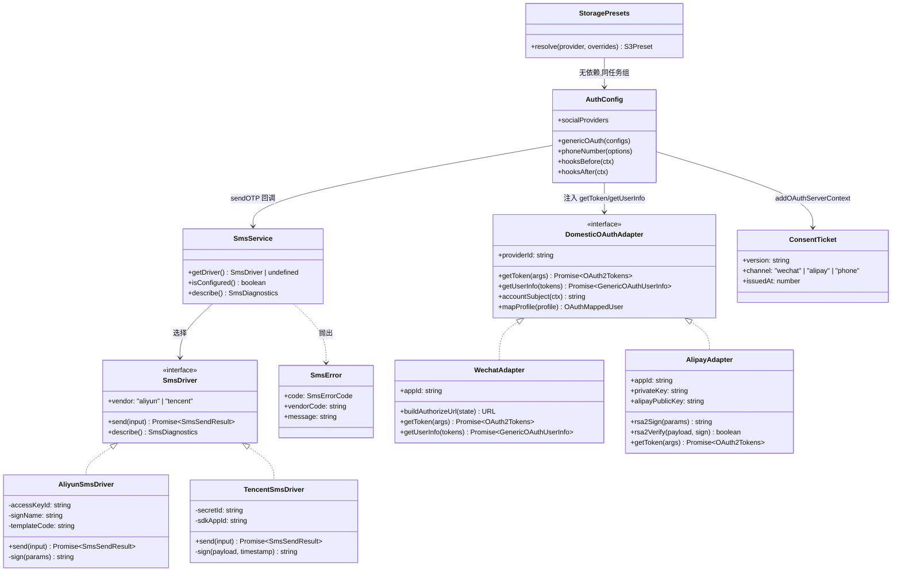
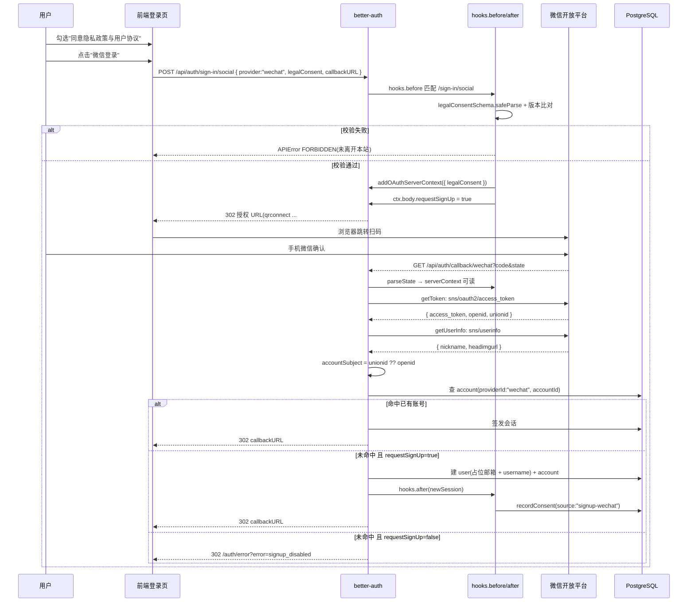
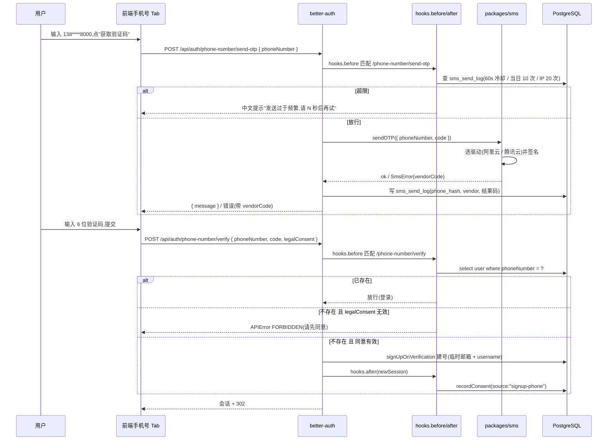
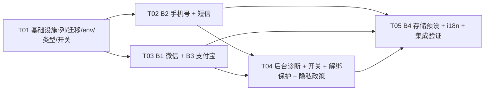

# 45 · B 档国产服务对接(B1/B2/B3/B4)—— 增量架构设计与任务分解

> 编制日期:2026-09-28 · 编制人:高见远(架构师)· 阶段:**设计**,本次只出设计文档,不写实现代码
> 上游:`plans/44-b-dang-prd.md`(PRD)、`plans/42-project-plan.md` §2.2 / §3.2 / §4.1
> 代码基线:`C:\Development\Project\School\reactive-resume` · better-auth **1.7.3**(已核到 `node_modules`,非 lockfile)
> 范围:B1 微信扫码登录、B2 手机号 + 短信验证码、B3 支付宝扫码登录、B4 国产对象存储 + 通用登记点

---

## 0. 结论摘要

| 架构问题 | 结论 | 关键依据 |
|---|---|---|
| 一、第三方注册同意链路 | **推荐 B″:前置同意 + `addOAuthServerContext` 服务端票据 + `disableImplicitSignUp` 阻断 + `hooks.after` 同请求落库**。合规上等价"先同意后建号",且不产生孤儿账号。PRD 设想的"回调后中间页"(方案 B)**在 better-auth 1.7.3 内不可行**,需自建 OAuth 插件(2.5~3 天)才能做到;方案 A / C 不推荐 | `dist/api/state/oauth.mjs:19-36`、`dist/oauth2/state.mjs:20-35`、`dist/api/routes/callback.mjs:229`、`dist/oauth2/link-account.mjs:196` |
| 二、微信技术路径 | **走 `genericOAuth` 新增 `providerId: "wechat"`,不用内置 `wechat`**。差异由 `getToken` / `getUserInfo` / `authorizationUrlParams` / `pkce: false` / `accountSubject` 完全承接,**不需要自建适配路由** | `dist/plugins/generic-oauth/types.d.mts:19-210`、`dist/api/routes/callback.mjs:213` |
| 二、支付宝技术路径 | **同样走 `genericOAuth` 新增 `providerId: "alipay"`**。RSA2 签名与验签写在 `getToken` / `getUserInfo` 内部,**不需要自建适配路由** | 同上 |
| 三、签名代码落点 | 新建 **`packages/sms`**(`runtime:server` + `role:infra`),与 `packages/email` 同构;支付宝 RSA2 签名放 **`packages/auth/src/domestic-oauth/`**(不进 `packages/utils`,避免污染 browser 运行时) | `packages/email/package.json`、`packages/email/turbo.json` |
| 三、短信限流覆盖 | 插件自带 `/phone-number/*` 60s/10 次;**`/sign-in/phone-number` 与自建的 60s 冷却 / 单号每日 10 次 / 单 IP 每小时 20 次由 `hooks.before` 覆盖**,计数落新表 `sms_send_log`(同时充当 P-9 审计) | `dist/plugins/phone-number/index.mjs:45-52` |

**任务顺序硬约束**:`42-project-plan.md` §3.2 计划"Drizzle 停更、迁 Python",因此 **B 档全部列变更必须在 T01 一次性生成迁移**,B2 不得晚于该节点。

---

## 1. 架构问题一:第三方注册的同意链路

### 1.1 事实基线(逐条核到 better-auth 1.7.3 源码)

| # | 事实 | 证据 |
|---|---|---|
| F1 | `databaseHooks.user.create.before` 只收到 `newUser`,**没有请求上下文** | `packages/auth/src/config.ts:339` |
| F2 | `hooks.after` 能拿到 `ctx.context.newSession`(含 `session.ipAddress` / `userAgent`) | `packages/auth/src/config.ts:308-314` |
| F3 | `hooks.before` 在端点处理前运行,可 `throw APIError` **终止请求**(此时尚未建号) | `packages/auth/src/config.ts:240-290` |
| F4 | 存在 `addOAuthServerContext(values)`:**从 `/sign-in/social` 的 before 钩子写入,随 state 加密持久化并在回调可读**,注释明确"cannot be spoofed by the client" | `dist/api/state/oauth.mjs:19-36` |
| F5 | `generateState` 把 `serverContext` 与 `requestSignUp: c.body?.requestSignUp` 一起写入 state,TTL 600×1000 ms | `dist/oauth2/state.mjs:20-35` |
| F6 | `parseState` 后回写 `setOAuthState(parsedData)`,回调路径上 `getOAuthState()` 可读 | `dist/oauth2/state.mjs:63` |
| F7 | 回调里 `disableSignUp = provider.disableImplicitSignUp && !requestSignUp \|\| provider.options?.disableSignUp` | `dist/api/routes/callback.mjs:229` |
| F8 | `disableSignUp` **只阻断"创建"分支**,已存在的 account 仍正常登录(返回 `{error:"signup disabled", isRegister:false}`) | `dist/oauth2/link-account.mjs:196-200` |
| F9 | 回调里 `if (!userInfo.email) → redirectOnError(EMAIL_NOT_FOUND)`;`userInfo.email` 取的是 **`{...raw, ...mapped}`**,即 `mapProfileToUser` 返回的占位邮箱可以过这一关 | `dist/api/routes/callback.mjs:213`、`dist/plugins/generic-oauth/index.mjs:229-238` |
| F10 | `result.isRegister` 时跳 `newUserURL \|\| callbackURL` —— 存在"新用户专用跳转",但**此时账号已建** | `dist/api/routes/callback.mjs:253-256` |
| F11 | `genericOAuth` 的 `config` 是数组,可注册多个 `providerId`;与内置 provider 同 id 会告警 | `dist/plugins/generic-oauth/index.mjs:78-86`、`271-273` |

### 1.2 三个方案的可行性结论

| 方案 | 可行性 | 要动的文件 | 工作量 | 判定 |
|---|---|---|---|---|
| **A · 前端后置确认**(照常建号,首次进入应用弹窗,确认后调 procedure 写 `user_consent`) | 技术上完全可行 | `packages/auth/src/config.ts`(`consentSourceFor` 或新增 procedure)、新增 `packages/api/src/features/legal/*`、新增前端拦截层 | 1~1.5 天 | **不推荐**。账号先于同意存在;用户关闭弹窗 = 一个没有同意记录却已生效的账号,正是 A10 想消灭的状态;且需要"未确认账号"的清理策略 |
| **B · 改 better-auth 注册链路**(回调后重定向到同意中间页 + 短期票据 + 延迟建号) | **在 better-auth 1.7.3 的钩子里不可行**。F1 说明建号钩子无请求上下文无法重定向;F8/F10 说明 better-auth 没有"暂停并稍后恢复"的状态机 —— 一旦回调跑完,账号与会话都已落库(F10)。要真正做到延迟建号只能**不用 `/callback/:id` 终局化**,改为自建 OAuth 插件:自己接管 authorize/callback、自己 `createSession` + `setSessionCookie`、自己建号 | 新增 `packages/auth/src/domestic-oauth-plugin.ts`(自定义 `createAuthEndpoint` ×2 + internalAdapter 会话签发)、`packages/db` 待建账号暂存表、`apps/web/src/routes/auth/consent-oauth.tsx`、`config.ts` 插件注册 | **2.5~3 天** | **不推荐**。成本高,且"已建号 + 未同意"的窗口仍需回滚逻辑;唯一好处(中间页能显示 `wxid_****a1b2`)不足以抵消 |
| **C · 不做同意记录**(仅在隐私政策/UI 声明) | 技术上零成本 | 无 | 0 | **不推荐**。与 `packages/auth/src/config.ts:56-71` 明确写下的取舍("writing a row for it would assert an acceptance that never happened")直接冲突,等于把 A10 已修的东西退回去 |
| **B″ · 前置同意(推荐)** | **可行,且正好落在 F3 + F4 + F7 的交集上** | 见 §1.3 | **0.5~1 天** | **推荐** |

### 1.3 推荐方案 B″ 的设计

**核心论证**:合规要求的是 *"账号被创建之前,用户已经明确表达了同意"*,而不是 *"必须有一个回调之后的中间页"*。把勾选框放在**登录页、跳转之前**,用户在离开本站前就完成了勾选;服务端把它变成不可伪造的票据随 state 往返,并在**同一个回调请求内**建号 + 落 `user_consent`。既没有"先有账号后补同意"的时间窗,也不会出现"创建了账号但用户拒绝"的孤儿账号 —— 这一点**严格优于**方案 A 与 B。

代价:中间页只能显示"微信扫码"这个通道名,无法显示 `wxid_****a1b2`(回调后才知道)。PRD §4.6 的标识展示降级为 P2。

**服务端四道闸门**

| 闸门 | 位置 | 作用 |
|---|---|---|
| G1 版本校验 | `hooks.before` 匹配 `/sign-in/social` | 读 `ctx.body.legalConsent`,`legalConsentSchema.safeParse` + `version === legalDocumentVersion`;不合法直接 `APIError("FORBIDDEN")`,**用户根本跳不出去** |
| G2 票据固化 | 同一个 before 钩子 | 校验通过后 `await addOAuthServerContext({ legalConsent: { version, channel } })`;并写 `ctx.body.requestSignUp = true`(服务端置位,不接受客户端传入值) |
| G3 建号阻断 | provider 配置 `disableImplicitSignUp: true` | 即使 G1/G2 被绕过,回调里 `disableImplicitSignUp && !requestSignUp === true` → 走 F8 的"signup disabled"分支,**不会建号**;已有账号仍正常登录(F8) |
| G4 落库 | `hooks.after` 匹配 `/callback/wechat` `/callback/alipay` | `(await getOAuthState())?.serverContext?.legalConsent` 存在 **且** `newSession` 存在 → 复用现有 `recordConsent()` 写 `user_consent`,`source` = `signup-wechat` / `signup-alipay` |

**`ConsentSource` 扩三个成员**:`signup-email`(现状)、`signup-wechat`、`signup-alipay`、`signup-phone`(文件位置 `packages/auth/src/config.ts:54`)。`"manual"` 继续保留为未启用的预留值。

### 1.4 手机号通道的同意链路(比 OAuth 更强)

手机号与 OAuth 的关键差异:**手机号在请求体里**,服务端在 `hooks.before` 就能判断"这个号是不是新用户",不需要等回调。

| 步骤 | 位置 | 逻辑 |
|---|---|---|
| 1 | `hooks.before` 匹配 `/phone-number/verify` | 读 `ctx.body.phoneNumber`(E.164)→ 查 `user.phoneNumber` |
| 2 | 同上 | **命中** = 登录,放行;**未命中** = 将注册 → 要求 `ctx.body.legalConsent` 通过校验,否则 `APIError("FORBIDDEN")` |
| 3 | `hooks.after` 匹配 `/phone-number/verify` | 同请求内 `ctx.body` 仍可读 → 复用同一判据,命中则写 `user_consent`,`source = signup-phone` |

因此手机号通道**不需要任何中间页**,登录页手机号 Tab 内的勾选框即为同意入口,服务端能精确区分登录与注册。

---

## 2. 架构问题二:微信与支付宝的技术路径

### 2.1 结论:两条都走 `genericOAuth`,不自建适配路由,不用内置 `wechat`

| 差异点 | 微信 | 承接方式 |
|---|---|---|
| 授权 URL 需要 `#wechat_redirect` 片段 | `qrconnect` + `snsapi_login` | `authorizationUrl = "https://open.weixin.qq.com/connect/qrconnect#wechat_redirect"`;`createAuthorizationURL` 用 `URL.searchParams` 追加参数,**按 URL 规范 query 位于 fragment 之前**,结果形如 `...?appid=...&redirect_uri=...#wechat_redirect`,正确 |
| 参数名是 `appid` 不是 `client_id` | 同上 | `authorizationUrlParams: { appid, ... }`;`client_id` 会被一并带上,微信授权端忽略未知参数 |
| 不支持 PKCE | — | `pkce: false`(`GenericOAuthConfig` 原生字段) |
| 换 token 是 GET + query,返回 JSON 且错误码在 body | `sns/oauth2/access_token` | **`getToken({ code, redirectURI })`** 自定义:自己发 GET、自己判 `errcode`、返回 `OAuth2Tokens`(`accessToken` / `refreshToken` / `accessTokenExpiresAt` / `scopes`)并**附带 `openid` / `unionid` 额外字段**(`getToken` 的返回值会原样传给 `getUserInfo`,`dist/plugins/generic-oauth/index.mjs:201`) |
| 拉资料需要 `access_token` + `openid` 两个参数 | `sns/userinfo` | **`getUserInfo(tokens)`** 自定义:读 `tokens.openid`,返回 `GenericOAuthUserInfo`(其类型带 `[key: string]: unknown` 索引签名,可承载任意厂商字段) |
| 匹配键 unionid 优先、openid 回落 | — | **`accountSubject: ({ profile }) => profile.unionid ?? profile.openid`**;`openid` 另存 `account.openid` 新列(见 §6) |
| 不返回邮箱 | — | `mapProfileToUser` 返回占位邮箱 `wechat_<accountId>@users.noreply.<实例域>`、`emailVerified: false` → 过 F9 的 `!userInfo.email` 检查;`username` 用 `toUsername()` 归一化(Q4 口径) |

**为什么不用内置 `wechat`**:内置实现只支持 `platformType: "WebsiteApp"` 与 `lang`,无法改授权参数、无法自定义 `getToken`/`getUserInfo`、无法注入占位邮箱;而 `WeChatProfile` 明确 `Email is currently unsupported`,必然撞 F9。内置 provider 唯一的优势(`accountSubject` 默认取 openid)用一行 `accountSubject` 就能复现。

### 2.2 支付宝:`genericOAuth` + RSA2 签名/验签

| 环节 | 承接方式 |
|---|---|
| 授权跳转 | `authorizationUrl = "https://openauth.alipay.com/oauth2/publicAppAuthorize.htm"`,`authorizationUrlParams: { app_id, scope: "auth_user" }`,`pkce: false` |
| 换 token | **`getToken`**:POST `https://openapi.alipay.com/gateway.do`,公共参数(`app_id`/`method=alipay.system.oauth.token`/`format=JSON`/`charset=utf-8`/`sign_type=RSA2`/`timestamp`/`version=1.0`/`biz_content`)+ **RSA2 签名** |
| 响应验签 | `getToken` 内部:取出 `sign`,按支付宝规则拼验签串,`crypto.verify("sha256", ...)` 用支付宝公钥校验;**失败一律抛错**,不允许"本地联调跳过"(A-4) |
| 拉资料 | **`getUserInfo`**:`method=alipay.user.info.share`,同样签名 + 验签;`nick_name` / `avatar` 缺失时返回空串而不抛错(Q3 口径) |
| 匹配键 | `accountSubject: ({ profile }) => profile.user_id` |

### 2.3 签名/验签代码的落点(包边界)

| 代码 | 落点 | 理由 |
|---|---|---|
| 阿里云 HMAC-SHA1 公共参数签名、腾讯云 TC3-HMAC-SHA256 | **新包 `packages/sms`** | 与 `packages/email` 同构(独立包、`turbo.json` 标签 `["runtime:server","role:infra"]`、export map 暴露 `./types` / `./drivers`);`packages/auth` 只依赖其导出,不内联 |
| 支付宝 RSA2 签名与验签 | **`packages/auth/src/domestic-oauth/alipay/signature.ts`** | 只在 OAuth 回调链路里用,放进 `packages/auth` 避免再开一个包;`packages/auth` 已是 `runtime:server`,可安全使用 `node:crypto` |
| 微信/支付宝的 URL 构造与响应解析 | **`packages/auth/src/domestic-oauth/{wechat,alipay}/*.ts`** | 同上 |
| **禁止** | 不放进 `packages/utils` | `packages/utils` 有多个 browser 侧导出(`./style`、`./color`),塞入 `node:crypto` 会破坏运行时边界 |

---

## 3. 架构问题三:短信驱动放哪、怎么接

### 3.1 新包 `packages/sms`

```text
packages/sms/
  package.json          # name: @reactive-resume/sms,exports: "./types" "./drivers" "./errors"
  turbo.json            # tags: ["runtime:server","role:infra"]
  tsconfig.json
  vitest.config.ts
  src/
    types.ts            # SmsDriver 接口、SmsSendResult、SmsErrorCode
    errors.ts           # SmsError(code, vendorCode, message)
    drivers/
      aliyun.ts         # SendSms 2017-05-25,HMAC-SHA1 公共参数签名
      tencent.ts        # SendSms 2021-01-11,TC3-HMAC-SHA256
      index.ts          # 凭证齐全判定 + 驱动选择(照抄 storage/service.ts:380-386)
    signature/
      aliyun.ts         # percentEncode / 规范化查询串 / HMAC-SHA1 / Base64
      tencent.ts        # 规范请求 / 待签串 / SecretDate→SecretService→SecretSigning
    errors-mapping.ts   # 厂商错误码 → 统一中文文案
    *.test.ts
```

驱动接口:

```ts
export interface SmsDriver {
  readonly vendor: "aliyun" | "tencent";
  send(input: { phoneNumber: string; templateParams: Record<string, string> }): Promise<SmsSendResult>;
  describe(): { configured: boolean; missing: string[]; preview: string };
}

export type SmsSendResult =
  | { ok: true; vendorMessageId: string }
  | { ok: false; code: SmsErrorCode; vendorCode: string; message: string };
```

### 3.2 `sendOTP` 注入与"三项齐全才启用"

- 在 `packages/auth/src/config.ts` 的 `plugins` 数组里注册 `phoneNumber({ otpLength: 6, expiresIn: 300, allowedAttempts: 3, sendOTP, signUpOnVerification: { getTempEmail, getTempName } })`。
- `sendOTP` 实现位于 `packages/auth/src/sms-otp.ts`:调用 `packages/sms` 驱动 → 失败时**抛带 `vendorCode` 的错误**(G-4),并记录 `sms_send_log`。
- **启用判定照抄 `packages/api/src/features/storage/service.ts:380-386`**:`SMS_PROVIDER` + 该厂商的 AccessKey/Secret + SignName + TemplateCode 全部非空才构造驱动,否则 `getSmsDriver()` 返回 `undefined`;`sendOTP` 拿到 `undefined` 时抛"SMS_NOT_CONFIGURED",前端与管理后台按 G-4 显示中文 + 原始错误码。
- **无资质自检**:`describe()` 返回"已配置 / 未配置 + 缺哪个变量 / 凭证预览(仅后 4 位)";管理后台「发送测试短信」走 oRPC procedure,把驱动的 `vendorCode` 原样返回(`InvalidAccessKeyId.NotFound`、`isv.SMS_TEMPLATE_ILLEGAL`、`AuthFailure.SignatureExpire` 等)。

### 3.3 限流:覆盖插件自带的盲区

插件自带 `pathMatcher: path => path.startsWith("/phone-number")`,`window: 60 / max: 10`(`dist/plugins/phone-number/index.mjs:45-52`)。**`/sign-in/phone-number` 与 `/phone-number/reset-password` 不在其内**,且该规则是"每窗口 10 次"而非 PRD 要求的"单号每日 10 次 / 单 IP 每小时 20 次"。因此:

| 规则 | 实现位置 | 计数存储 |
|---|---|---|
| 单号 60s 冷却 | `hooks.before` 匹配 `/phone-number/send-otp` | `sms_send_log` 查该号最近一条 `sentAt` |
| 单号每日 10 次 | 同上 | `sms_send_log` 按 `phone_hash` + 当日 count |
| 单 IP 每小时 20 次 | 同上(`ctx.context` 可拿到 IP,`advanced.ipAddress.ipAddressHeaders` 已配) | `sms_send_log.ip_hash` |
| 验证码 300s / 最多 3 次校验 | 插件原生 `expiresIn` / `allowedAttempts` | — |
| `/sign-in/phone-number` 爆破 | 追加 `rateLimitConfig.betterAuth.global.customRules["/sign-in/phone-number"] = { window: 60, max: 5 }` | better-auth 内置 |

`sms_send_log` 同时满足 P-9(脱敏手机号 `phone_hash` + 厂商 + 结果码 + 时间,保留 30 天)。

---

## 4. 数据结构与接口



---

## 5. 关键调用流程

### 5.1 微信扫码登录(含前置同意与建号)



### 5.2 手机号验证码登录



---

## 6. 数据库变更与迁移(必须一次性完成)

`packages/db/src/schema/auth.ts`:

| 表 | 新增列 | 类型 | 说明 |
|---|---|---|---|
| `user` | `phoneNumber` | `text`,唯一,可空 | better-auth `phoneNumber` 插件要求(`dist/plugins/phone-number/schema.d.mts`) |
| `user` | `phoneNumberVerified` | `boolean`,默认 `false`,`input: false` | 同上 |
| `account` | `openid` | `text`,可空 | 微信 `openid` 与 `accountId`(unionid)不同时留存(W-3) |

`packages/db/src/schema/sms.ts`(新表):

| 表 | 列 |
|---|---|
| `sms_send_log` | `id`、`phone_hash`(text,索引)、`ip_hash`(text,可空,索引)、`vendor`、`result_code`、`vendor_code`、`created_at`(索引 desc) |

> 唯一约束上的多个 `NULL` 在 PostgreSQL 中互不冲突,`user.phoneNumber` 大量为空不会报错。
>
> 迁移生成:`pnpm db:generate`(`packages/db/drizzle.config.ts` 的 `out: "../../migrations"`,当前 35 个)。**必须在 Drizzle 停更前完成**,故归入 T01。

---

## 7. 环境变量与登记点清单

### 7.1 新增环境变量(两处都要登记,漏一处运行时就是 `undefined`)

| 变量 | 用途 | `packages/env/src/server.ts` 插入点 | `turbo.json` `globalEnv` 插入点 |
|---|---|---|---|
| `WECHAT_APP_ID` / `WECHAT_APP_SECRET` | 微信开放平台 | 第 46 行(Social Auth 段)之后 | 第 69 行 `OAUTH_SCOPES` 之后 |
| `ALIPAY_APP_ID` / `ALIPAY_PRIVATE_KEY` / `ALIPAY_PUBLIC_KEY` | 支付宝 | 同上 | 同上 |
| `SMS_PROVIDER` / `ALIYUN_ACCESS_KEY_ID` / `ALIYUN_ACCESS_KEY_SECRET` / `ALIYUN_SMS_SIGN_NAME` / `ALIYUN_SMS_TEMPLATE_CODE` / `TENCENT_SECRET_ID` / `TENCENT_SECRET_KEY` / `TENCENT_SMS_SDK_APP_ID` / `TENCENT_SMS_SIGN_NAME` / `TENCENT_SMS_TEMPLATE_ID` | 短信 | 第 68 行(SMTP 段)之后 | 第 78 行 `S3_FORCE_PATH_STYLE` 之后 |
| `STORAGE_PROVIDER` | B4 预设 | 第 77 行 `S3_FORCE_PATH_STYLE` 之后 | 同上 |

### 7.2 加一个 provider 必须动的全部登记点(≥6 处,漏一处即编译红或 UI 不显示)

| # | 文件 | 位置 |
|---|---|---|
| 1 | `packages/env/src/server.ts` | 对应注释块 |
| 2 | `turbo.json` | `globalEnv` |
| 3 | `packages/auth/src/config.ts` | `genericOAuth` 的 `authConfigs` 数组(或 `socialProviders`) |
| 4 | `packages/api/src/features/auth/service.ts` | `providers.list`(第 11-22 行)+ `router.ts` 描述文案(第 12-14 行) |
| 5 | `packages/auth/src/types.ts` | `AuthProvider` 联合类型(第 9 行) |
| 6 | `apps/web/src/features/settings/authentication/components/hooks.tsx` | `getProviderName`(第 23-62 行)与 `getProviderIcon`(第 67-76 行)两处 `.exhaustive()` |
| 7 | `apps/web/src/features/auth/components/social-auth.tsx` | 手写 `<Button>`(第 81-164 行)+ 图标 import(第 4 行) |
| 8 | `apps/web/src/features/settings/authentication/index.tsx` | `{"x" in enabledProviders && ...}`(第 25-35 行) |
| 9 | `apps/web/locales/{en-US,zh-CN,zh-TW}.po` | `pnpm --filter web lingui:extract`(`--clean --overwrite` 会清掉未引用条目,抽取前先确认无手改条目) |
| 10 | `apps/server/src/static/web.ts` | 仅当新增**公开**页面:第 29 行 `indexableAppPaths` 与第 30-43 行 `reservedPublicResumeSegments` |

### 7.3 实例开关(沿用 DB > 环境变量 > 默认)

`packages/auth/src/instance-settings.ts` 第 21 行 `OVERRIDABLE_SETTING_KEYS` 新增 `disableWechatAuth` / `disableAlipayAuth` / `disableSmsAuth`,并同步 `DEFAULTS`(37-40)、`ENV_VALUES`(42-45)、`ENV_NAMES`(47-50)三张表 + `apps/web/src/routes/admin/settings.tsx` 第 23-36 行 `SETTING_COPY`。

> 该层**只支持 `boolean`**(第 95 行 `typeof row.value !== "boolean"` 直接丢弃),正好匹配 G-2 的三个开关。
> 注意:OAuth provider 的配置在 `config.ts` 第 491 行 `export const auth = getAuthConfig()` 时**已冻结**,运行时开关只能作用于"拦截端点",不能改变 provider 是否注册 —— 因此 G-3 的判据必须同时写在 `providers.list`(UI 侧)与 `hooks.before`(端点侧),与现有第 245 行对邮箱路径的处理保持一致。

---

## 8. 任务分解(有序,按依赖排列)

### T01 · 基础设施:数据库列、迁移、环境变量、类型与开关骨架

**优先级** P0 · **依赖** 无 · **估时** 1 天

| 文件 | 动作 |
|---|---|
| `packages/db/src/schema/auth.ts` | `user` 加 `phoneNumber` / `phoneNumberVerified`;`account` 加 `openid` |
| `packages/db/src/schema/sms.ts` | 新建 `sms_send_log` |
| `packages/db/src/schema/index.ts` | 导出新表 |
| `migrations/` | `pnpm db:generate`(**必须在 Drizzle 停更前**) |
| `packages/env/src/server.ts` | 新增 §7.1 全部变量 |
| `turbo.json` | `globalEnv` 同步登记 |
| `packages/auth/src/types.ts` | `AuthProvider` 加 `wechat` / `alipay` / `phone` |
| `apps/web/src/features/settings/authentication/components/hooks.tsx` | `getProviderName` / `getProviderIcon` 补分支(否则 typecheck 红) |
| `packages/auth/src/instance-settings.ts` | 三个新开关 key + 三张映射表 |
| `packages/auth/src/config.ts` | `ConsentSource` 扩成员;占位函数骨架 |

**完成判据**:`pnpm typecheck` 绿、`pnpm exec turbo boundaries` 绿、迁移文件已生成且只含 B 档列。

### T02 · B2 手机号 + 短信验证码(阿里云 / 腾讯云)

**优先级** P0 · **依赖** T01 · **估时** 2.5~3 天

| 文件 | 动作 |
|---|---|
| `packages/sms/package.json` `turbo.json` `tsconfig.json` `vitest.config.ts` | 新包脚手架(标签 `["runtime:server","role:infra"]`) |
| `packages/sms/src/types.ts` `errors.ts` `errors-mapping.ts` | 驱动接口、`SmsError`、厂商错误码 → 中文映射 |
| `packages/sms/src/signature/aliyun.ts` `tencent.ts` | HMAC-SHA1 公共参数签名 / TC3-HMAC-SHA256 |
| `packages/sms/src/drivers/aliyun.ts` `tencent.ts` `index.ts` | 真实驱动 + 凭证齐全判定 |
| `packages/sms/src/*.test.ts` | 官方示例向量单测、错误码映射单测、启用判定单测 |
| `packages/auth/src/sms-otp.ts` | `sendOTP` 实现、`signUpOnVerification` 临时邮箱/用户名 |
| `packages/auth/src/config.ts` | 注册 `phoneNumber` 插件;`hooks.before` 冷却/频次/同意;`hooks.after` 落 `user_consent`;`rateLimitConfig` 补 `/sign-in/phone-number` |
| `packages/utils/src/rate-limit.ts` | `customRules` 追加条目 |
| `packages/api/src/features/auth/service.ts` | `providers.list` 加 `phone` |
| `packages/api/src/features/sms/router.ts` `service.ts` | 管理后台「发送测试短信」+ 诊断 |
| `apps/web/src/features/auth/components/phone-auth.tsx` | 手机号 Tab(60s 倒计时、脱敏提示) |
| `apps/web/src/features/auth/pages/login.tsx` | 邮箱/手机号 Tab 切换 |
| `apps/web/src/features/settings/authentication/components/phone-section.tsx` | 脱敏显示、更换、解绑 |
| `apps/web/src/features/settings/authentication/index.tsx` | 挂载手机号 Section |
| `apps/web/src/libs/auth/client.ts` | 注册 `phoneNumberClient` |

### T03 · B1 微信 + B3 支付宝扫码登录

**优先级** P0 · **依赖** T01 · **估时** 2.5~3 天

| 文件 | 动作 |
|---|---|
| `packages/auth/src/domestic-oauth/wechat/*.ts` | 授权 URL、`getToken`、`getUserInfo`、`accountSubject`、`mapProfile`(占位邮箱 + `username`) |
| `packages/auth/src/domestic-oauth/alipay/signature.ts` | RSA2 签名 + 验签(`node:crypto`) |
| `packages/auth/src/domestic-oauth/alipay/*.ts` | `getToken` / `getUserInfo` / `accountSubject` |
| `packages/auth/src/consent.ts` | 同意票据封装:`addOAuthServerContext` 写入 + `getOAuthState()` 读取 |
| `packages/auth/src/config.ts` | `authConfigs` 追加 `wechat` / `alipay`(`pkce:false`、`disableImplicitSignUp:true`);`hooks.before` 四道闸门;`hooks.after` 落库;`trustedProviders` 追加(Q11) |
| `packages/api/src/features/auth/service.ts` | `providers.list` 加 `wechat` / `alipay` |
| `apps/web/src/features/auth/components/social-auth.tsx` | 两个新按钮 + 图标 |
| `apps/web/src/features/settings/authentication/index.tsx` | 微信 / 支付宝 Section |
| `apps/web/src/routes/auth/error.tsx` | 取消授权 / 二维码过期 / `40029` 等中文文案 |
| `packages/auth/src/**/*.test.ts` | 授权 URL 构造单测、占位邮箱单测、同意闸门单测 |

### T04 · 管理后台诊断与开关、解绑保护、隐私政策

**优先级** P0 · **依赖** T02、T03 · **估时** 1.5~2 天

| 文件 | 动作 |
|---|---|
| `packages/api/src/features/admin/diagnostics-service.ts` | 只读诊断:三条通道 + 短信 + 存储(已配置 / 缺哪个变量 / 凭证后 4 位) |
| `packages/api/src/features/admin/router.ts` | 挂载诊断与测试短信 procedure |
| `packages/api/src/features/admin/setting-service.ts` | 新 key 的读写与审计 |
| `apps/web/src/routes/admin/settings.tsx` | 「国产登录与短信」「对象存储」两个分区 + `SETTING_COPY` 新条目 |
| `apps/web/src/features/settings/admin/*` | 诊断卡片、测试短信表单 |
| `apps/web/src/features/settings/authentication/components/social-provider.tsx` | 解绑保护(剩余登录方式 ≥ 1) |
| `apps/web/src/routes/_home/privacy.tsx` | 补「手机号用途 / 短信服务商 / 第三方登录标识」三段 |
| `packages/schema/src/legal.ts` | `legalDocumentVersion` bump(与政策文案同步) |

### T05 · B4 国产对象存储预设 + 全链路集成与验证

**优先级** P0(B4)/ P1(验证)· **依赖** T02、T03、T04 · **估时** 1.5~2 天

| 文件 | 动作 |
|---|---|
| `packages/env/src/server.ts` | `STORAGE_PROVIDER`(`auto` / `oss` / `cos` / `obs` / `s3`) |
| `turbo.json` | `globalEnv` 登记 |
| `packages/api/src/features/storage/service.ts` | 预设解析:**显式 `S3_ENDPOINT` 优先**,未显式时按 `STORAGE_PROVIDER` 取预设,冲突打日志(S-1/S-2) |
| `packages/api/src/features/storage/presets.ts` | 三家 endpoint / region / `forcePathStyle` 预设表 |
| `packages/api/src/features/storage/router.ts` | 健康检查文案区分 `local` / `s3` / `oss` / `cos` / `obs`(S-3) |
| `packages/api/src/features/storage/*.test.ts` | 预设解析与冲突判定单测 |
| `DEPLOYMENT.md` | 三家最小配置示例(S-4) |
| `apps/web/locales/*.po` | `pnpm --filter web lingui:extract` 全量抽取,核对 `zh-CN` / `zh-TW` missing 为 0(G-5) |

三家预设(不与显式 `S3_ENDPOINT` 冲突时生效):

| `STORAGE_PROVIDER` | endpoint 预设 | region 示例 | `forcePathStyle` |
|---|---|---|---|
| `oss` | `https://oss-<region>.aliyuncs.com` | `oss-cn-hangzhou` | `false`(虚拟托管) |
| `cos` | `https://cos.<region>.myqcloud.com` | `ap-guangzhou` | `true`(路径式) |
| `obs` | `https://obs.<region>.myhuaweicloud.com` | `cn-north-4` | `true`(路径式) |
| `s3` / `auto` | 沿用现状(仅凭证判定) | `us-east-1` | 沿用 `S3_FORCE_PATH_STYLE` |

### 任务依赖图



> **排序理由**:T01 内含全部 Drizzle 迁移,先于 `42-project-plan.md` §3.2 的"Drizzle 停更"节点;T02 与 T03 彼此只共享 T01 的产物,**可并行**;B4(S-1/S-2)按口径排在三条通道之后,单独成 T05。

---

## 9. 验证方式(无资质下的可验证边界)

| 模块 | 可验证手段 | 结论标注 |
|---|---|---|
| 阿里云 HMAC-SHA1 签名 | 官方示例向量单测(规范化查询串 → HMAC-SHA1 → Base64 → `percentEncode`) | 实现完整,**未经真实调用验证** |
| 腾讯云 TC3-HMAC-SHA256 | 官方文档"签名方法 v3"示例向量单测(规范请求 → 待签串 → 三级密钥派生) | 同上 |
| 支付宝 RSA2 签名/验签 | 自签自验往返单测 + 硬编码的官方示例密钥对向量 | 同上 |
| 错误码映射 | 每家 ≥4 个错误码的映射单测(输入厂商码 → 断言中文文案与 `SmsErrorCode`) | 可自测 |
| 微信授权 URL 构造 | 断言 `appid` / `redirect_uri` / `scope` / `state` 与 `#wechat_redirect` 位置 | 可自测 |
| 占位邮箱 / `username` 生成 | 单测断言符合 `^[a-z0-9._-]+$` 与长度 3~64 | 可自测 |
| 同意闸门 | 单测模拟 `hooks.before`:缺同意 → 断言抛 `FORBIDDEN`;`serverContext` 存在 → 断言落 `user_consent` | 可自测 |
| 限流计数 | 用内存时钟 + 测试库跑 60s / 10 次 / 20 次三条边界 | 可自测 |
| 存储预设解析 | 显式 `S3_ENDPOINT` 与预设冲突的判定单测 | 可自测 |
| 端到端扫码 / 真实短信 | **无法验证**,需企业资质 | 明示"实现完整但未经真实服务商调用验证" |

---

## 10. 待明确事项(需要用户拍板)

| # | 事项 | 影响 | 建议 |
|---|---|---|---|
| 1 | 同意入口是否接受"登录页勾选"(推荐方案 B″)而放弃 PRD §4.6 的"回调后中间页" | 接受 = T03 省 2 天且不产生孤儿账号;坚持中间页 = 必须自建 OAuth 插件(+2.5~3 天)并额外设计孤儿账号回滚 | 接受 B″,中间页降 P2 |
| 2 | 占位邮箱域名取 `<实例域>`(如 `users.noreply.example.com`)还是固定 `users.noreply.local` | 前者需从 `APP_URL` 派生且要求域名可控;后者简单但不可达 | 从 `APP_URL` 派生,缺失时回落 `users.noreply.local` |
| 3 | `legalDocumentVersion` 的 bump 值(当前 `2026-09-28`) | 隐私政策三段补完后必须 bump,否则新老同意记录版本号错位 | 随 T04 上线日期取当天 |
| 4 | 短信审计 `sms_send_log` 的 30 天清理方式 | 需要定时清理机制,本仓目前无 cron/调度设施 | 查询侧按 30 天过滤,清理脚本留给部署者(cron/外部),本期不引入调度依赖 |
| 5 | 「发送测试短信」在无资质实例上的默认行为 | 真实调用必然失败(返回厂商错误码),是否允许管理员反复触发 | 允许,但前端对同一号码加 60s 冷却并提示"将产生真实计费" |

---

## 11. Anything UNCLEAR(设计层假设)

1. **微信 `getToken` 返回 `OAuth2Tokens` 附带 `openid` / `unionid`**:类型上需要一次断言(`OAuth2Tokens` 无索引签名),运行时 `dist/plugins/generic-oauth/index.mjs:201` 会把 `getToken` 的返回值原样传给 `getUserInfo`,故可行;若上游将来对返回值做字段裁剪,需改回在 `getUserInfo` 里二次换取。
2. **`ctx.body.requestSignUp = true` 的可写性**:依据 `dist/oauth2/state.mjs:29` 读的是 `c.body?.requestSignUp`,而 `hooks.before` 先于端点运行,故中间件改写 `ctx.body` 生效;若 better-auth 后续版本冻结 body,则改为在 `hooks.before` 里对 `/sign-in/social` 自行校验后在回调侧用 `serverContext` 单独判定。
3. **`oauth-popup` / `oauth-proxy` 插件未启用**,本设计不涉及站内二维码弹窗(W-8,P2)。
4. **实例设置层不支持非 boolean 值**,因此 B4 的 endpoint / bucket / region 只做只读诊断,不做运行时表单(S-5 已明确不做)。
