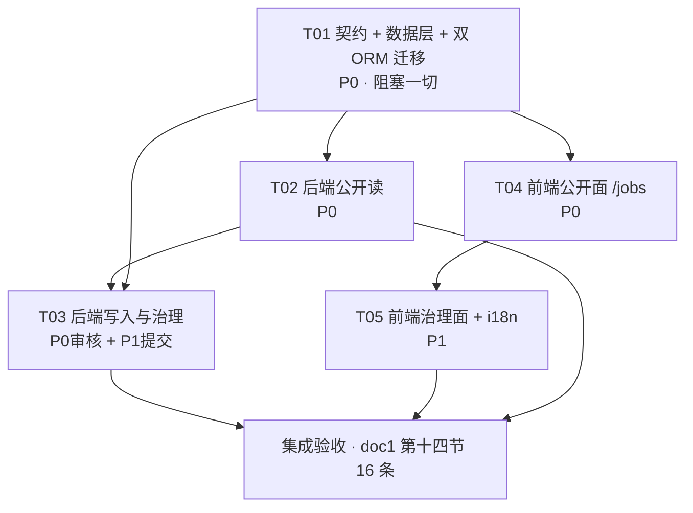
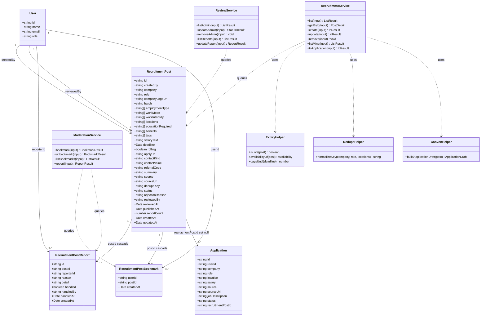
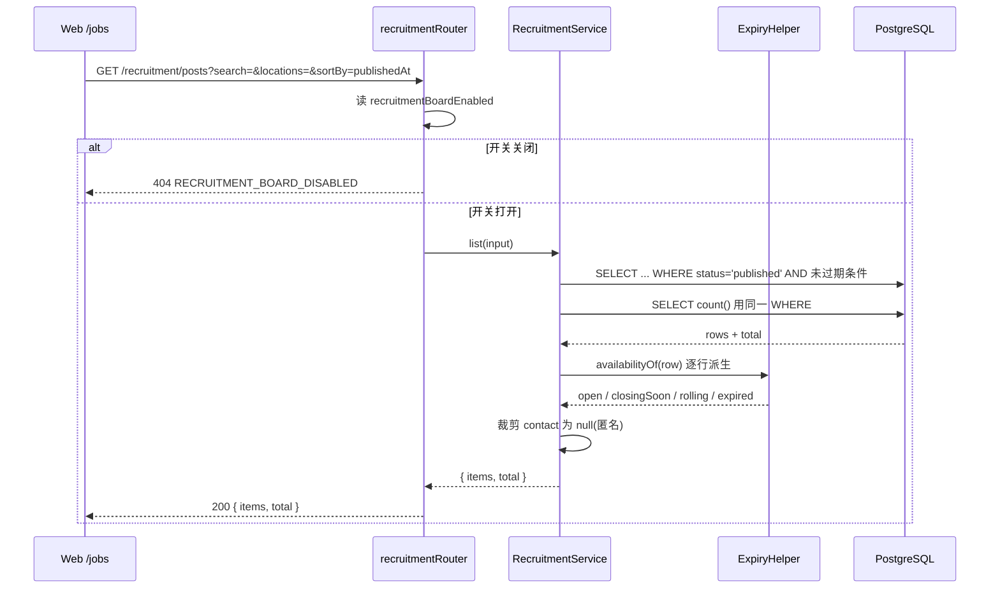
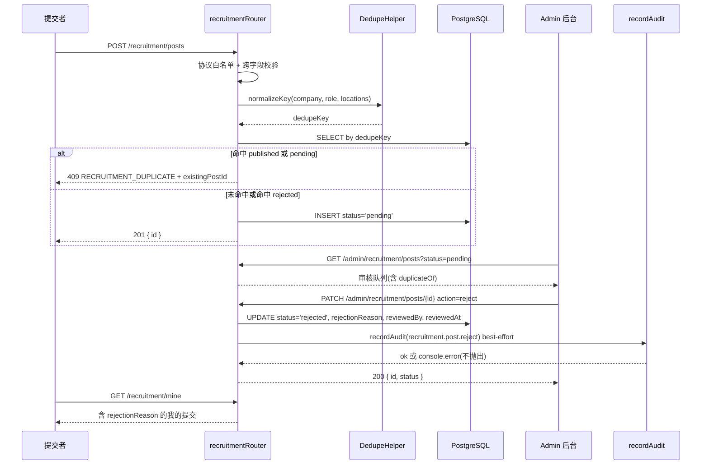
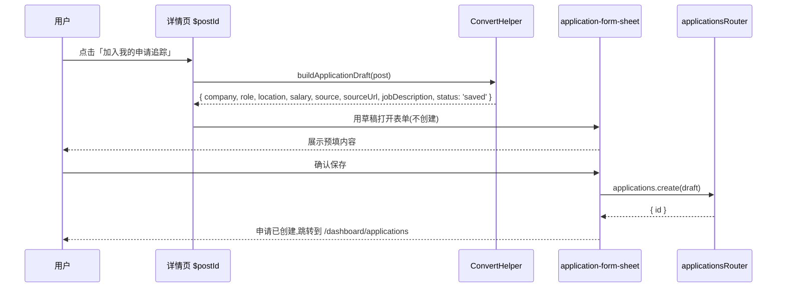

# 46 · 校招岗位板(Campus Recruitment Board)—— 实施方案设计与任务分解

状态:**施工图,未实施**。本文档只定方案与契约,不含实现代码。
日期:2026-09-29
权威需求源:`plans/_sources/doc1.md`(4071 行,「37 — 校招信息汇总(Campus Recruitment Board)设计」,设计书 / 未实施)
工期口径:`plans/42-project-plan.md` §4.2 第 2 项 ——「校招岗位板(doc1,6~7 天,新建 `recruitment_post` / `_report` / `_bookmark` 三表)」
前置阅读:`plans/11-job-search-policy.md`、`plans/36-admin-console.md`、`plans/42-project-plan.md` §3.2、`AGENTS.md`

> **本文档的用法**:第 4 节(API 契约)是**冻结契约**。后端与前端各自照着它写,不需要来回问。
> 契约一旦开工不再单方面改动;确需改动必须同步更新本文件并在任务里回写。

---

## 0. 结论先行

| 项 | 结论 |
|---|---|
| 做什么 | 一个**自托管实例内的半公开校招岗位板**:服务端分页筛选的岗位列表 + 详情 + 审核队列 + 举报/收藏 + 一键转入已有 `application` 流水线 |
| 不做什么 | 不接第三方招聘 API、不爬取、不自动投递、不渲染富文本、不建用户黑名单表(理由见 §1.2) |
| 新增表 | 3 张:`recruitment_post`(32 列)、`recruitment_post_report`(9 列)、`recruitment_post_bookmark`(3 列) |
| API 端点 | 16 个:公开 2 / 受保护 9 / 管理员 5 |
| 落地方式 | **双 ORM**:Drizzle 只做「类型 + 查询 + 迁移」,Alembic `0002` 与 SQLAlchemy 模型同步落地(§6) |
| 默认状态 | **默认关闭**(`recruitmentBoardEnabled = false`)。关闭时公开端点返回 **404 而不是 403**,侧边栏无入口 |
| 最大风险 | 被误判为「JSearch 复活」。PR 描述必须贴 §1.1 的对照表 |
| 超期先砍 | 收藏 → 举报 → 管理端审核队列(§1.4) |

---

## 1. 范围裁定

### 1.1 这不是「恢复 JSearch」

`plans/11-job-search-policy.md` 记录了 v5.0.20 存在、v5.1.0 被移除的 JSearch / RapidAPI 职位列表,并给出恢复职位列表的前置条件清单。本设计逐条回应:

| plan 11 的前置条件 | 本设计的处置 |
|---|---|
| integration ownership | 无第三方集成。数据由本实例的用户提交 / 管理员录入,所有权在本实例 |
| credential encryption | 不适用。不持有任何第三方招聘 API 凭据 |
| quotas / 429 / timeouts | 不适用。无外部配额;自身入站限流见 §4.6 |
| result schema | 自有 Zod schema,落在 `packages/schema/src/recruitment/`(§3.9) |
| owner isolation | 查询一律按 `status = published` 过滤;提交者只能看到自己的 `pending` / `rejected` |
| untrusted job-content handling | 正面处理:简介纯文本、链接协议白名单、`contact` 整体对匿名为 `null`、Logo 用首字母占位(§4.4) |
| disabled by default | 默认关闭,复用 `instance_setting` 的「DB > 环境变量 > 默认」三级解析(§4.5) |

一句话定位:这不是「恢复 JSearch」,而是**把 codecv 那种社区维护的岗位板,做成本产品数据库里的一等公民,并把内容治理的账算清楚**。数据是人提交的静态信息,不是机器查询的实时结果。

### 1.2 明确不做(原样继承 doc1 第一节,补充本设计的理由)

| 不做 | 原样继承的理由 | 本设计补充的执行含义 |
|---|---|---|
| 接入任何付费招聘数据 API | 与 plan 11 的结论直接冲突 | 不引入任何外部 HTTP 客户端依赖;`packages/api` 依赖清单不变 |
| 爬取第三方招聘站点 | 合规风险 + 反爬不稳定 + 需要长期维护解析器 | 无爬虫、无定时任务、无队列(§3.6 的时效判定因此必须是读时计算) |
| 自动投递简历 | 不可逆的外部动作,超出本产品职责边界 | 「一键转入追踪」只在本库里建一条 `application`,不发任何外部请求 |
| 岗位内容渲染富文本 HTML | 会重新引入已清理掉的依赖 | `summary` 为纯文本。**不要把 `sanitize-html` 加回 `packages/api`** —— plan 36 第十四节刚把它作为 unused dependency 清掉,加回来等于把 knip 从绿打回红 |
| 建「用户黑名单」表 | 自托管规模下管理员直接禁用账号即可 | 复用 Better Auth admin 插件已有的 `setBan`(`packages/api/src/features/admin/router.ts` 的 `adminSetUserBan`) |
| codecv 的「996 / WLB」价值观标签 | 用标签做价值观评价,审核时无法客观判断 | 改为中性 `workIntensity`:`standard` / `intensive`(§3.2) |
| 内置初始岗位数据集 | 内置就要回答「谁来维护它」 | 空板起步,不 seed |

### 1.3 P0 / P1 与 6~7 天时间账

总纲给的是 **6~7 天**。doc1 第十三节原本是 P0/P1/P2/P3 四阶段;本设计压成 **P0(必须做完)+ P1(有余力再做)**,并明确 P0 是「可交付的最小闭环」。

**P0 —— 必须完成(约 4.5~5 天)**

1. 契约层:枚举、DTO、去重键归一化(`packages/schema/src/recruitment/`)
2. 数据层:Drizzle 三表 + 迁移;Alembic `0002` + SQLAlchemy 三模型(§6)
3. 三个实例开关 + `flags` 端点暴露
4. 公开列表 + 详情 API(服务端分页筛选、字段裁剪、协议白名单)
5. `/jobs` 列表页 + `/jobs/$postId` 详情页(筛选器 / 列表列 / 时效徽标)
6. `/admin/recruitment` 审核队列(批准 / 驳回填理由 / 下架 / 删除)+ 4 条审计动作
7. **「加入我的申请追踪」预填**(总纲 §5.1 超期削减顺序第 3 条写的是「校招岗位板精简为『列表 + 筛选 + 加入追踪』」,可见这是不可砍的核心)

**P1 —— 有余力再做(约 1.5~2 天)**

1. 用户提交(限流 + 去重 + 进队列)、`/dashboard/recruitment` 我的提交页、编辑回退重审
2. 举报(`recruitment_post_report` + 唯一约束 + 管理端举报队列)
3. 收藏(`recruitment_post_bookmark` + 我的收藏)
4. 举报「标记已处理」端点(`handled` / `handledBy` / `handledAt`)
5. `application.recruitment_post_id` 加列(可选,§3.8)

**不在本次**:MCP 四个工具、`score_application_match` 匹配度、管理员批量导入(CSV / JSON)。

### 1.4 超期削减顺序(与总纲 §5.1 对齐)

总纲 §5.1 第 3 条已经给了口径:超期时把校招岗位板**精简为「列表 + 筛选 + 加入追踪」**(省 3~4 天)。
因此本设计的削减顺序是:

1. **先砍收藏**(0.5 天)—— 表留着,只是不做 UI 与端点
2. **再砍举报**(0.5 天)—— 表留着;治理退化为「审核队列 + 去重」
3. **再砍管理端审核队列的富交互**(0.5 天)—— 保留批准 / 驳回,去掉下架与直接编辑
4. **再砍 P1 全部**(1.5~2 天)—— 只留管理员在后台录入 + 公开浏览,这正是 doc1 建议的「先用管理员手动录入跑通完整链路,再开放用户提交」

**不砍**:列表与筛选(门面)、字段裁剪(安全硬要求,见 §4.4)、一键转申请(doc1 与总纲共同的核心)。

---

## 2. 现状基座(已核实,全部复用,不另起炉灶)

| 能力 | 现状 | 位置 | 本设计怎么用 |
|---|---|---|---|
| 权限层级 | 已有 `publicProcedure` / `protectedProcedure` / `adminProcedure` | `packages/api/src/context.ts`(67 / 78 / 99 行) | 三档直接对应 §4.1 的三组端点 |
| 路由聚合 | 已有 11 个 router 的默认导出对象 | `packages/api/src/routers/index.ts` | 追加一行 `recruitment: recruitmentRouter`,并把 `admin/recruitment` 挂到既有 `adminRouter` |
| DTO 集中地 | 已有 `admin.ts` / `application.ts` / `resume.ts` | `packages/api/src/dto/` | **新增** `packages/api/src/dto/recruitment.ts` |
| 服务端分页契约 | 已有 `{ items, total }` + `limit` / `offset` | `packages/api/src/dto/admin.ts` | 沿用 `limit` / `offset`,**不用** page / pageSize(见 §4.2) |
| 排序白名单 | 已有:排序字段走 zod enum | `packages/api/src/dto/admin.ts` | 沿用,理由见 §4.2 |
| 审计 | 已有 `admin_audit_log` + `recordAudit()`(best-effort,内部 try/catch) | `packages/api/src/features/admin/audit.ts`、`audit-service.ts` | 复用 `recordAudit`;审计必须 `leftJoin` user(`actor_id` 是 set null) |
| 审计动作常量 | 已有 `AUDIT_ACTIONS`(`dotted.verb`)+ `AUDIT_TARGET_TYPES` | `packages/api/src/audit-actions.ts`(**顶层**,避免 `dto → features → dto` 循环依赖) | 追加 4 个动作 + 1 个 target type(§4.7) |
| 管理后台表格基座 | 已有列表页模式:搜索防抖 / 状态筛选 / 服务端分页 | `apps/web/src/routes/admin/{users,resumes,audit}.tsx` | 审核队列照抄这套 |
| 数据表格组件 | 已有 `@tanstack/react-table` v8 封装 | `packages/ui/src/components/data-table.tsx` | 复用;**锁 `8.21.3`,不要升 v9** |
| 入站限流 | 已有 `createRatelimitMiddleware` 工厂 + 7 个档位 | `packages/api/src/middleware/rate-limit/index.ts`、配置在 `packages/utils/src/rate-limit.ts` 的 `rateLimitConfig.orpc` | 追加 2 个档位(§4.6) |
| 实例级开关 | 已有「DB > 环境变量 > 默认」三级解析 + TTL 缓存 | `packages/auth/src/instance-settings.ts` | 追加 3 个 key(§4.5) |
| 前端 flags 通道 | 已有 `client.flags.get()` 注入到根路由 context | `apps/web/src/routes/__root.tsx`(第 94~103 行)+ `packages/api/src/features/flags/router.ts` | 追加 `recruitmentBoardEnabled` 一个布尔(§4.5) |
| 投递追踪 | 已有六阶段流水线;`application` 已含 `source` / `source_url` / `job_description` | `packages/api/src/features/applications/`、`packages/db/src/schema/applications.ts` | 一键转申请复用 `applications.create`,**不新写写入逻辑**(§5.7) |
| 侧边栏 | 已有 `appSidebarItems` / `adminSidebarItems` | `apps/web/src/routes/dashboard/-components/sidebar.tsx`(49 / 100 行) | 各追加一项(§5.2) |
| Python 迁移地基 | M1~M3 已完成:Alembic 基线 `0001` + SQLAlchemy 模型 + 身份 | `services/resume-api/` | 追加 `0002` 与三个模型(§6) |

**结论**:地基全部现成。真正新建的只有三张表、一层 API、四个页面,外加把岗位接到 `application` 的那一次点击。

---

## 3. 数据模型

### 3.1 表命名与字段映射(codecv → 本设计)

表名采用总纲 §4.2 的口径,带 `recruitment_post_` 前缀(doc1 第六节写的是 `recruitment_report` / `recruitment_bookmark`,本设计统一加前缀以便三张表在 `psql \dt` 里聚合显示)。

| codecv 字段 | 本设计字段 | 变化说明 |
|---|---|---|
| `logo` | `companyLogoUrl` | 保留,但**不直出第三方外链图**(等于把每个访客的 IP 送给第三方);默认走首字母占位 |
| `job` | `role` | 与 `application.role` 同名,便于一键转入时直接映射 |
| `corporation` | `company` | 同上,与 `application.company` 同名 |
| `type[]` | `employmentType[]` | 收敛为 `campus` / `internship` / `summerInternship` / `social` |
| `tags[]` | `tags[]` + `benefits[]` | 拆分:`tags` 自由标签,`benefits` 专管福利(修正 codecv 缺陷 6 的语义混装) |
| `endTime`(自由文本) | `deadline`(timestamptz,可空)+ `rolling`(bool) | 结构化。`rolling = true` 即「尽快投递」(修正 codecv 缺陷 2) |
| `educational_required[]` | `educationRequired[]` | 保留,枚举细化(§3.9) |
| `remark` | `summary` | 改为纯文本客观简介;codecv 示例里「领导很好,本人亲试」这类主观背书不进本项目 |
| `external_link`(string) | `applyUrl` | 协议白名单校验 |
| `external_link`(object) | `contactKind` + `contactValue` | 不再公开渲染,仅登录可见(修正 codecv 缺陷 4) |
| —— | `batch` | 新增:提前批 / 正式批 / 补录,中国校招的核心时间维度 |
| —— | `locations[]` | 新增:独立于公司名的工作城市,否则无法按城市筛选 |
| —— | `workMode[]` + `workIntensity[]` | 新增:**doc1 内部冲突,本设计拆分**(见下方说明) |
| —— | `source` + `sourceUrl` | 新增:来源标注与溯源 |
| —— | `status` + 审核字段 | 新增:治理必需 |
| —— | `dedupeKey` | 新增:去重(修正 codecv 缺陷 7) |

**对 doc1 的一处修正(doc1 §6.2 与 §6.3 自相矛盾)**:
§6.2 的字段表把 `workMode` 定义为 `onsite` / `hybrid` / `remote`(工作地点形态);
§6.3 又说「`workMode` 承接 `WLB` / `996` 这类工作时间语义,改为中性 `standard` / `intensive`」。
两者是不同维度,塞进一个数组会让「按标签筛选」给出错误结果(正是 codecv 缺陷 6)。本设计**拆成两个字段**:

- `workMode[]`:`onsite` / `hybrid` / `remote`
- `workIntensity[]`:`standard` / `intensive`(中性表达,不作价值观标注)

### 3.2 `recruitment_post` —— 岗位主表(32 列)

| # | 字段(camelCase / snake_case) | 类型 | 可空 | 默认 | 为什么存在 |
|---|---|---|---|---|---|
| 1 | `id` / `id` | text PK | 否 | `generateId()` | 仓库惯例(`packages/db/src/schema/applications.ts` 同款) |
| 2 | `createdBy` / `created_by` | text FK → `user.id`,on delete **set null** | 是 | —— | 提交者;null 表示管理员导入。set null 保证删账号不删岗位 |
| 3 | `company` / `company` | text | 否 | —— | 公司名称;与 `application.company` 同名,一键转入直接映射 |
| 4 | `role` / `role` | text | 否 | —— | 岗位名称;与 `application.role` 同名 |
| 5 | `companyLogoUrl` / `company_logo_url` | text | 是 | —— | 公司 logo。**不直出外链**;缺省走首字母占位 |
| 6 | `batch` / `batch` | text(枚举) | 否 | `'regular'` | 提前批 / 正式批 / 补录 —— 中国校招的核心时间维度 |
| 7 | `employmentType` / `employment_type` | text[] | 否 | `{}` | 校招 / 实习 / 暑期实习 / 社招;多值因为一个岗位可同时招实习生与应届生 |
| 8 | `workMode` / `work_mode` | text[] | 否 | `{}` | 坐班 / 混合 / 远程 |
| 9 | `workIntensity` / `work_intensity` | text[] | 否 | `{}` | 标准工时 / 高强度(中性,替代 codecv 的 `996` / `WLB`) |
| 10 | `locations` / `locations` | text[] | 否 | `{}` | 工作城市(多值),独立于公司名才能按城市筛选 |
| 11 | `educationRequired` / `education_required` | text[] | 否 | `{}` | 学历要求枚举(§3.9),中国校招真正用来决策的维度 |
| 12 | `benefits` / `benefits` | text[] | 否 | `{}` | 福利标签,从 codecv 混装的 18 项里只取福利语义的 7 项 |
| 13 | `tags` / `tags` | text[] | 否 | `{}` | 自由标签(公司 / 岗位),零配置零管理后台 |
| 14 | `salaryText` / `salary_text` | text | 是 | —— | 薪资自由文本。校招多为区间或面议,**不做结构化** |
| 15 | `deadline` / `deadline` | timestamptz | 是 | —— | 结构化截止时间。timestamptz 是仓库惯例(修正 codecv 缺陷 2) |
| 16 | `rolling` / `rolling` | boolean | 否 | `false` | 长期招聘 / 尽快投递。`true` 时忽略 `deadline` |
| 17 | `applyUrl` / `apply_url` | text | 是 | —— | 投递链接,服务端校验只允许 `http:` / `https:` |
| 18 | `contactKind` / `contact_kind` | text(枚举) | 是 | —— | `wechat` / `email` / `phone` / `referral`。微信内推是国内主流形式,通用招聘站只认 URL 反而用不上 |
| 19 | `contactValue` / `contact_value` | text | 是 | —— | 联系方式值。**公开接口的响应 schema 里不存在这个字段名**(§4.4) |
| 20 | `referralCode` / `referral_code` | text | 是 | —— | 内推码,中国校招核心信息。同样不进公开 schema |
| 21 | `summary` / `summary` | text | 是 | —— | 岗位简介,**纯文本**(不存 HTML),限定客观岗位信息 |
| 22 | `source` / `source` | text(枚举) | 是 | —— | `official` / `referral` / `community`,来源标注 |
| 23 | `sourceUrl` / `source_url` | text | 是 | —— | 原始公告链接,便于核实真伪。**与 `applyUrl` 二者必填其一** |
| 24 | `dedupeKey` / `dedupe_key` | text **unique** | 否 | —— | 归一化去重键,服务端生成不信任客户端(§3.7) |
| 25 | `status` / `status` | text(枚举) | 否 | `'pending'` | `draft` / `pending` / `published` / `rejected` / `closed` / `expired`,治理必需 |
| 26 | `rejectionReason` / `rejection_reason` | text | 是 | —— | **doc1 §8.5 要求「驳回必填理由且回传给提交者」,但 §6.2 的字段表漏了这一列,本设计补上** |
| 27 | `reviewedBy` / `reviewed_by` | text FK → `user.id`,on delete **set null** | 是 | —— | 审核人。set null 与 `createdBy` 同款 |
| 28 | `reviewedAt` / `reviewed_at` | timestamptz | 是 | —— | 审核时间 |
| 29 | `publishedAt` / `published_at` | timestamptz | 是 | —— | 排序键(默认 `publishedAt desc`) |
| 30 | `reportCount` / `report_count` | integer | 否 | `0` | 举报计数。**公开列表不展示**(避免被人当武器用),仅管理端可见 |
| 31 | `createdAt` / `created_at` | timestamptz | 否 | `now()` | 仓库惯例 |
| 32 | `updatedAt` / `updated_at` | timestamptz | 否 | `now()` + `$onUpdate` | 仓库惯例(见 `applications.ts:54-58`) |

**时效性如何在模型里体现**:`deadline` + `rolling` + `status` 三件套(§3.6);列表默认只出「已发布且未过期」。
**治理需求如何在模型里体现**:`status` 审核状态机 + `dedupeKey` 唯一约束 + `reportCount` + `rejectionReason` + `source` / `sourceUrl` 溯源。

### 3.3 `recruitment_post_report` —— 举报(9 列)

需要独立表,因为它有「谁在什么时候举报了什么理由」—— 这不是一个计数器能表达的。

| # | 字段 | 类型 | 可空 | 默认 | 为什么存在 |
|---|---|---|---|---|---|
| 1 | `id` / `id` | text PK | 否 | `generateId()` | 仓库惯例 |
| 2 | `postId` / `post_id` | text FK → `recruitment_post.id`,on delete **cascade** | 否 | —— | 岗位删了,举报一起删 |
| 3 | `reporterId` / `reporter_id` | text FK → `user.id`,on delete **cascade** | 否 | —— | 举报人;与 `postId` 组成唯一约束 |
| 4 | `reason` / `reason` | text(枚举) | 否 | —— | `notHiring` / `fakeInfo` / `kpiFarming` / `duplicate` / `other` |
| 5 | `detail` / `detail` | text | 是 | —— | 补充说明 |
| 6 | `handled` / `handled` | boolean | 否 | `false` | 管理员是否已处理 |
| 7 | `handledBy` / `handled_by` | text FK → `user.id`,on delete **set null** | 是 | —— | **本设计新增**:处理人。没有它,`handled = true` 无法溯源 |
| 8 | `handledAt` / `handled_at` | timestamptz | 是 | —— | **本设计新增**:处理时间 |
| 9 | `createdAt` / `created_at` | timestamptz | 否 | `now()` | 仓库惯例 |

**唯一约束 `(postId, reporterId)`** —— 同一人对同一岗位只能举报一次(直接落到 DB,不靠应用层判断)。

### 3.4 `recruitment_post_bookmark` —— 收藏(3 列)

| # | 字段 | 类型 | 可空 | 默认 | 为什么存在 |
|---|---|---|---|---|---|
| 1 | `userId` / `user_id` | text FK → `user.id`,on delete **cascade** | 否 | —— | 复合主键之一 |
| 2 | `postId` / `post_id` | text FK → `recruitment_post.id`,on delete **cascade** | 否 | —— | 复合主键之一 |
| 3 | `createdAt` / `created_at` | timestamptz | 否 | `now()` | 收藏时间,「我的收藏」按它倒序 |

**复合主键 `(userId, postId)`** —— 天然幂等,`PUT` 收藏可重复调用。

### 3.5 索引与约束总表

| 表 | 名称 | 定义 | 为什么 |
|---|---|---|---|
| `recruitment_post` | `uq_recruitment_post_dedupe_key` | UNIQUE (`dedupe_key`) | 去重的物理保证(§3.7) |
| | `ix_recruitment_post_status_published_at` | (`status`, `published_at` DESC) | 主查询路径:列表页默认排序 |
| | `ix_recruitment_post_deadline` | (`deadline`) | 时效判定与 `deadline asc` 排序 |
| | `ix_recruitment_post_tags` | GIN (`tags`) | 关键词命中 tags(修正 codecv 缺陷 8) |
| | `ix_recruitment_post_locations` | GIN (`locations`) | 多值城市筛选必须 GIN,B-tree 对数组等值无效 |
| | `ix_recruitment_post_created_by` | (`created_by`) | 「我的提交」页 |
| | `ix_recruitment_post_status_report_count` | (`status`, `report_count` DESC) | 管理端「按举报数排序」 |
| `recruitment_post_report` | `uq_recruitment_post_report_post_reporter` | UNIQUE (`post_id`, `reporter_id`) | 一人一岗一次 |
| | `ix_recruitment_post_report_post_id` | (`post_id`) | 岗位详情 / 级联 |
| | `ix_recruitment_post_report_handled_created_at` | (`handled`, `created_at` DESC) | 举报队列 |
| `recruitment_post_bookmark` | `pk_recruitment_post_bookmark` | PRIMARY KEY (`user_id`, `post_id`) | 幂等 |
| | `ix_recruitment_post_bookmark_post_id` | (`post_id`) | 级联删除 / 统计收藏数 |

Drizzle 写法提示:数组上的 GIN 用 `pg.index("ix_recruitment_post_tags").using("gin", t.tags)`。

### 3.6 时效模型:读时计算,不做定时任务

本仓库没有 worker / cron / 队列基础设施(`compose.dev.yml` 只有 postgres / redis / seaweedfs)。因此:

**不引入后台任务把过期岗位改写成 `expired`。「过期」是一个查询条件,不是持久状态:**

```sql
status = 'published' AND (rolling = true OR deadline IS NULL OR deadline > now())
```

`status = 'expired'` **只在管理员手动下架时写入**(表达「这个岗位我确认关掉了」),与「自然过期」区分开。

好处:零新基础设施、无时钟漂移、无「任务没跑起来导致列表陈腐」的静默故障。
代价:过期岗位的行仍留在表里(千级数据量无害,且便于统计历史岗位总量)。

**派生字段 `availability`**(服务端统一算,前端不要自己算,避免各端算法漂移):

| 取值 | 判定 | 语义 |
|---|---|---|
| `rolling` | `rolling = true` | 长期招聘 / 尽快投递 |
| `expired` | `rolling = false AND deadline IS NOT NULL AND deadline <= now()` | 已截止 |
| `closingSoon` | `rolling = false AND deadline IS NOT NULL AND deadline > now() AND deadline < now() + interval '7 days'` | 即将截止(7 天内) |
| `open` | 其余 | 开放中 |

**「即将截止」的 7 天阈值由服务端统一定义**,不作为参数暴露给前端。

### 3.7 去重键 `dedupeKey`

由服务端归一化生成,**不信任客户端**:

```text
dedupeKey = lower(trim(company)) + '|' + lower(trim(role)) + '|' + (sorted(locations)[0] ?? '')
```

归一化函数在 `packages/schema/src/recruitment/dedupe.ts` 里实现并单测,要覆盖:全角 / 半角、连续空格、大小写、公司后缀剥离(「有限公司」「股份有限公司」「(中国)」等)。

命中规则:

| 命中已有行的状态 | 行为 |
|---|---|
| `published` | 返回 **409**,响应带 `existingPostId`,前端引导「补充信息」而不是重复提交 |
| `pending` | 返回 **409**,提示「已有人在审核队列里」 |
| `rejected` / `closed` / `expired` | **允许重新提交**(进审核队列),不静默吞掉 |

### 3.8 与 `application` 的衔接

doc1 §6.2 提出 `application` 加一列 `recruitmentPostId`(FK → `recruitment_post.id`,on delete **set null**),理由是「让『我投过这个岗位』可反向展示;岗位删除后申请记录存活」。

| 方案 | 采纳 | 说明 |
|---|---|---|
| A. 加列 `application.recruitment_post_id` | **P1,推荐** | 反向展示可靠。但动了一张已经在用的核心表,要一条迁移。`on delete set null` 与既有 `resume_id` 处理一致,保持「申请历史永远存活」的语义 |
| B. 不加列,用 `sourceUrl` 关联 | P0 兜底 | 零迁移。但 `sourceUrl` 可空且不保证唯一,只能做「URL 相同的申请」这种弱匹配 |

**P0 阶段按方案 B 实现**(零迁移),把「已投递」标记降级为不显示;`myApplicationId` 字段在契约里**预留为可选**(§4.4 注明),P1 加列后再填充。新增可选字段是向后兼容的,不会破坏已冻结的契约。

### 3.9 枚举清单(单一真源)

落在 `packages/schema/src/recruitment/data.ts`,同时导出 **值数组** 与 **zod enum**,供 DTO 与前端筛选项共用(避免硬编码漂移 —— 这是 plan 36 第十四节的既有模式)。

```text
batch              : early | regular | supplementary
employmentType     : campus | internship | summerInternship | social
workMode           : onsite | hybrid | remote
workIntensity      : standard | intensive
educationRequired  : 985_211 | bachelor | associate | upgraded | no_92_requirement | case_by_case
benefits           : afternoon_tea | meal_allowance | housing_allowance | insurance_5
                     insurance_6 | flexible_hours | no_clock_in
contactKind        : wechat | email | phone | referral
source             : official | referral | community
status             : draft | pending | published | rejected | closed | expired
reportReason       : notHiring | fakeInfo | kpiFarming | duplicate | other
availability(派生) : open | closingSoon | rolling | expired
```

`educationRequired` 与 codecv 的对照:

| 本设计取值 | codecv 对应 |
|---|---|
| `985_211` | `985/211本科` |
| `bachelor` | `统招本科` |
| `associate` | `专科` |
| `upgraded` | `专升本` |
| `no_92_requirement` | `不强制要求92` |
| `case_by_case` | `优秀可特批` |

i18n 提示:校招 / 985 / 211 在非中文语境下没有对应物,`en.po` 要描述性译法而不是音译(提前批 → Early batch,正式批 → Main batch,补录 → Supplementary round,统招本科 → Full-time bachelor's,不强制要求92 → No 985/211 requirement,优秀可特批 → Exceptions for strong candidates,内推码 → Referral code)。

---

## 4. API 契约(冻结)

### 4.1 端点总表

路径前缀沿用仓库既有风格(`/applications`、`/admin/users`),**不加 `/api` 前缀**(oRPC handler 已挂在 `/api/rpc`)。

| # | Method | Path | operationId | 权限 | 优先级 | 说明 |
|---|---|---|---|---|---|---|
| 1 | GET | `/recruitment/posts` | `listRecruitmentPosts` | public + 限流 | P0 | 服务端分页 + 筛选;响应 `{ items, total }` |
| 2 | GET | `/recruitment/posts/{id}` | `getRecruitmentPost` | public + 限流 | P0 | 详情;`contact` 按登录状态裁剪 |
| 3 | POST | `/recruitment/posts` | `createRecruitmentPost` | protected + 限流 | P1 | 提交,`status` 落 `pending`(审核关闭时直接 `published`) |
| 4 | PATCH | `/recruitment/posts/{id}` | `updateRecruitmentPost` | protected | P1 | 编辑自己提交的;已 `published` 的编辑回退到 `pending` |
| 5 | DELETE | `/recruitment/posts/{id}` | `deleteRecruitmentPost` | protected | P1 | 撤回自己提交的 |
| 6 | GET | `/recruitment/mine` | `listMyRecruitmentPosts` | protected | P1 | 我的提交(含 `pending` / `rejected` 及驳回理由) |
| 7 | GET | `/recruitment/bookmarks` | `listMyRecruitmentBookmarks` | protected | P1 | 我的收藏 |
| 8 | PUT | `/recruitment/posts/{id}/bookmark` | `bookmarkRecruitmentPost` | protected | P1 | 收藏(幂等) |
| 9 | DELETE | `/recruitment/posts/{id}/bookmark` | `unbookmarkRecruitmentPost` | protected | P1 | 取消收藏(幂等) |
| 10 | POST | `/recruitment/posts/{id}/report` | `reportRecruitmentPost` | protected + 限流 | P1 | 举报(唯一约束防重复) |
| 11 | POST | `/recruitment/posts/{id}/to-application` | `convertRecruitmentPostToApplication` | protected + 限流 | P0 | 一键转入追踪(§5.7) |
| 12 | GET | `/admin/recruitment/posts` | `adminListRecruitmentPosts` | admin | P0 | 审核队列 |
| 13 | PATCH | `/admin/recruitment/posts/{id}` | `adminUpdateRecruitmentPost` | admin | P0 | 批准 / 驳回(带理由)/ 下架 / 直接编辑 |
| 14 | DELETE | `/admin/recruitment/posts/{id}` | `adminDeleteRecruitmentPost` | admin | P0 | 删除 |
| 15 | GET | `/admin/recruitment/reports` | `adminListRecruitmentReports` | admin | P1 | 举报队列 |
| 16 | PATCH | `/admin/recruitment/reports/{id}` | `adminUpdateRecruitmentReport` | admin | P1 | 标记举报已处理 |

**权限分布:公开 2 / 受保护 9 / 管理员 5 = 16。**

与 doc1 §7.4 的差异只有一处:doc1 的管理员表列了 4 条,本设计**加了第 16 条**(`adminUpdateRecruitmentReport`)。理由:`recruitment_post_report.handled` 在 doc1 里有字段但没有写入端点,不改就是死数据。

管理员端点统一 `tags: ["Internal"]`(OpenAPI 生成器会过滤掉,不出现在公开文档)—— 照抄 `packages/api/src/features/admin/router.ts` 的既有写法。

**筛选项枚举不单独开端点**。doc1 §7.1 的模式是给 `packages/api/package.json` 加导出行:

```json
"./features/recruitment/options": "./src/features/recruitment/options.ts"
```

枚举是静态常量,前端直接 import,不走网络。

### 4.2 通用约定

**分页**:沿用 `packages/api/src/dto/admin.ts` 的既有约定 ——

```text
input : limit  (int, 1..100, default 20)   // 管理端 default 25,与 adminUserDto.list 一致
        offset (int, >=0,    default 0)
output: { items: [...], total: number }     // total = 过滤后的真实总数,不是本页条数
```

⚠️ 这是 codecv 缺陷 1(分页器恒为 1 页)的直接修正:`total` 必须是**过滤后总数**,与 `items.length` 无关。
doc1 验收第 4 条说的「`pageSize = 8` 时共 4 页」在本契约下对应 `limit=8&offset=24`。

**排序**:`sortBy` 走 zod enum 白名单(plan 36 第十一节第 4 条:排序字段会把列 id 直接写进 URL,后端不认的取值会让整个搜索参数校验失败、页面直接报错)。

```text
sortBy    : enum  ["publishedAt", "deadline", "createdAt"]           default "publishedAt"
            (管理端额外允许 "reportCount")
sortOrder : enum  ["asc", "desc"]                                    default "desc"
```

**数组筛选的语义(必须写死,否则前后端会错开)**:

- 同一字段内多值 = **OR**
- 不同字段之间 = **AND**
- 例:`employmentType=campus&employmentType=internship&locations=北京` 表示「(校招 OR 实习) AND 北京」

**日期**:一律 timestamptz;ISO 8601 字符串过线(zod `z.coerce.date()`),前端按用户本地时区渲染。

**审计**:所有管理员写操作先做主操作,再 `recordAudit()`;`recordAudit` 内部已 try/catch,**审计失败不能阻断主操作**(plan 36 第十一节第 8 条)。

### 4.3 输入 / 输出 DTO 逐字段定义

以下全部落在 `packages/api/src/dto/recruitment.ts`。每个字段都要 `.describe()`,因为 OpenAPI 文档直接读它。

#### 4.3.1 共享枚举 schema(从 `packages/schema` 引入)

```text
batchSchema / employmentTypeSchema / workModeSchema / workIntensitySchema
educationRequiredSchema / benefitSchema / contactKindSchema / sourceSchema
postStatusSchema / availabilitySchema / reportReasonSchema
```

#### 4.3.2 `recruitmentPostPublicSchema` —— 公开可见字段(列表项与详情的基础)

| 字段 | 类型 | 可空 | 说明 |
|---|---|---|---|
| `id` | string | 否 | |
| `company` | string | 否 | |
| `role` | string | 否 | |
| `companyLogoUrl` | string | 是 | 缺省时前端用首字母占位 |
| `batch` | enum | 否 | |
| `employmentType` | enum[] | 否 | |
| `workMode` | enum[] | 否 | |
| `workIntensity` | enum[] | 否 | |
| `locations` | string[] | 否 | |
| `educationRequired` | enum[] | 否 | |
| `benefits` | enum[] | 否 | |
| `tags` | string[] | 否 | |
| `salaryText` | string | 是 | |
| `deadline` | Date | 是 | ISO 8601 |
| `rolling` | boolean | 否 | |
| `availability` | enum | 否 | 服务端派生(§3.6),前端不要自己算 |
| `daysUntilDeadline` | number | 是 | 服务端派生;`rolling` 或 `deadline` 为空时是 `null` |
| `applyUrl` | string | 是 | 已过协议白名单 |
| `source` | enum | 是 | |
| `sourceUrl` | string | 是 | |
| `summary` | string | 是 | 纯文本 |
| `status` | enum | 否 | 公开列表恒为 `published` |
| `publishedAt` | Date | 是 | |
| `createdAt` | Date | 否 | |
| `updatedAt` | Date | 否 | |
| `bookmarked` | boolean | 否 | 当前调用者是否收藏;匿名恒 `false` |
| `myApplicationId` | string | 是 | **预留 P1**(§3.8)。P0 阶段恒 `null`,前端按 `null` 处理 |

**这个 schema 里没有、且永远不会有**:`contactKind`、`contactValue`、`referralCode`、`reportCount`、`createdBy`、`reviewedBy`、`reviewedAt`、`rejectionReason`。

#### 4.3.3 `contactSchema` —— 联系方式(整体裁切,不是逐字段裁切)

```text
contact: {
  kind         : enum   (wechat | email | phone | referral)
  value        : string
  referralCode : string | null
} | null
```

**匿名调用者拿到 `contact: null`**。这样 doc1 验收第 3 条(未登录请求的响应体里搜不到 `contactValue` / `referralCode` 的字段与值)天然成立:整个对象为 `null`,两个字段名根本不出现。

⚠️ 不要在匿名响应里返回 `contact: { value: null }` —— 那会让字段名出现在响应体里,验收第 3 条直接失败。

#### 4.3.4 端点 1 `GET /recruitment/posts` —— `listRecruitmentPosts`

input(schema 名 `recruitmentPostDto.list.input`):

| 字段 | 类型 | 默认 | 语义 |
|---|---|---|---|
| `search` | string,max 200 | —— | 关键词,ILIKE 匹配 `company` + `role` + `summary` + `tags`(补齐 codecv 缺陷 8:漏了 `job` 与 `tags`) |
| `role` | string,max 200 | —— | 岗位名子串 |
| `company` | string,max 200 | —— | 公司名子串 |
| `batch` | enum | —— | 单选 |
| `employmentType` | enum[] | —— | OR |
| `workMode` | enum[] | —— | OR |
| `workIntensity` | enum[] | —— | OR |
| `educationRequired` | enum[] | —— | OR |
| `benefits` | enum[] | —— | OR |
| `locations` | string[] | —— | OR,每元素 max 64 |
| `tags` | string[] | —— | OR |
| `availability` | enum | —— | `open` / `closingSoon` / `rolling`;`expired` 不通过这里查(用 `includeExpired`) |
| `includeExpired` | boolean | `false` | 是否包含已过期的已发布岗位 |
| `sortBy` | enum | `publishedAt` | |
| `sortOrder` | enum | `desc` | |
| `limit` | int 1..100 | `20` | |
| `offset` | int >=0 | `0` | |

output:`{ items: recruitmentPostPublicSchema[], total: number }`

**强制过滤**:`status = 'published'` 且满足 §3.6 的未过期条件(除非 `includeExpired = true`)。
**开关门禁**:`recruitmentBoardEnabled = false` 时直接抛 **404**(不是 403 —— 不暴露板块存在)。

#### 4.3.5 端点 2 `GET /recruitment/posts/{id}` —— `getRecruitmentPost`

input:`{ id: string }`
output:`recruitmentPostPublicSchema & { contact: contactSchema }`

可见性规则:

| 调用者 | 岗位状态 | 结果 |
|---|---|---|
| 任何人 | `published`(未过期) | 200;`contact` 按是否登录裁切 |
| 登录用户 | 自己提交的 `pending` / `rejected` / `draft` | 200(带 `rejectionReason`) |
| 登录用户 | 他人提交的 `pending` / `rejected` / `draft` | **404** |
| 管理员 | 任意 | 200 |
| 任何人 | `closed` / `expired` | **404**(公开面) |

`rejectionReason` 只在「本人 or 管理员」的响应里出现,因此放在详情 output 的可选字段上,匿名时为 `null`。

#### 4.3.6 端点 3 `POST /recruitment/posts` —— `createRecruitmentPost`

input(字段名与 §3.2 一一对应):

| 字段 | 类型 | 必填 | 约束 |
|---|---|---|---|
| `company` | string | 是 | 1..200 |
| `role` | string | 是 | 1..200 |
| `companyLogoUrl` | string | 否 | 协议白名单 |
| `batch` | enum | 否 | 默认 `regular` |
| `employmentType` | enum[] | 否 | 默认 `[]`,至少 1 项(提交时校验非空) |
| `workMode` | enum[] | 否 | 默认 `[]` |
| `workIntensity` | enum[] | 否 | 默认 `[]` |
| `locations` | string[] | 否 | 默认 `[]`,每项 1..64,最多 10 项 |
| `educationRequired` | enum[] | 否 | 默认 `[]` |
| `benefits` | enum[] | 否 | 默认 `[]` |
| `tags` | string[] | 否 | 默认 `[]`,每项 1..32,最多 10 项 |
| `salaryText` | string | 否 | max 100 |
| `deadline` | Date | 否 | 必须晚于 `now()`(否则 400) |
| `rolling` | boolean | 否 | 默认 `false` |
| `applyUrl` | string | 否 | **只允许 `http:` / `https:`,其余一律拒绝(不是清洗,是拒绝)** |
| `contactKind` | enum | 否 | 与 `contactValue` 成对:给了其中一个必须给另一个 |
| `contactValue` | string | 否 | max 200 |
| `referralCode` | string | 否 | max 64 |
| `summary` | string | 否 | max 2000,**纯文本** |
| `source` | enum | 否 | |
| `sourceUrl` | string | 否 | 协议白名单 |

**跨字段校验两条**:
1. `applyUrl` 与 `sourceUrl` **二者必填其一**(400 `RECRUITMENT_SOURCE_REQUIRED`)
2. `contactKind` 与 `contactValue` 成对出现

output:`{ id: string }`(与 `applications.create` 的既有形状一致)

行为:`status` 服务端落 `pending`;若 `recruitmentRequireReview = false` 则直接 `published` 并写 `publishedAt`。
`recruitmentSubmissionEnabled = false` 时,非管理员调用抛 **403**。

#### 4.3.7 端点 4 `PATCH /recruitment/posts/{id}` —— `updateRecruitmentPost`

input:`{ id: string }` + §4.3.6 的**全部可选字段**(可增量更新)
output:`{ id: string }`

行为:
- 只允许提交者本人(他人 → 403 `RECRUITMENT_NOT_OWNER`)
- 当前 `status = published` 的岗位被编辑 → 回退到 `pending` 重新审核,`publishedAt` 置 `null`
- 重新计算 `dedupeKey`(公司名 / 岗位名 / 城市变了,去重键要跟着变)

#### 4.3.8 端点 5 `DELETE /recruitment/posts/{id}` —— `deleteRecruitmentPost`

input:`{ id: string }`  output:`z.void()`
只允许提交者本人。管理员走端点 14。

#### 4.3.9 端点 6 `GET /recruitment/mine` —— `listMyRecruitmentPosts`

input:

| 字段 | 类型 | 默认 | 语义 |
|---|---|---|---|
| `status` | enum | —— | `draft` / `pending` / `published` / `rejected` / `closed` / `expired` |
| `limit` | int 1..100 | `20` | |
| `offset` | int >=0 | `0` | |

output:`{ items: recruitmentPostOwnerSchema[], total: number }`
`recruitmentOwnerSchema` = `recruitmentPostPublicSchema` + `contact` + `rejectionReason` + `reportCount`。

#### 4.3.10 端点 7 `GET /recruitment/bookmarks` —— `listMyRecruitmentBookmarks`

input:`{ limit, offset }`(默认 20 / 0)
output:`{ items: recruitmentPostPublicSchema[], total: number }`
排序固定 `bookmark.createdAt desc`。已过期 / 已下架的岗位**仍然返回**(收藏是用户的私人清单,但 `availability` 字段会如实显示 `expired`)。

#### 4.3.11 端点 8 / 9 收藏与取消

- `PUT /recruitment/posts/{id}/bookmark` → input `{ id }`,output `{ bookmarked: true }`,幂等
- `DELETE /recruitment/posts/{id}/bookmark` → input `{ id }`,output `{ bookmarked: false }`,幂等

底层是复合主键插入 / 删除,重复调用不报错。

#### 4.3.12 端点 10 `POST /recruitment/posts/{id}/report` —— `reportRecruitmentPost`

input:

| 字段 | 类型 | 约束 |
|---|---|---|
| `id` | string | 岗位 id |
| `reason` | enum | `notHiring` / `fakeInfo` / `kpiFarming` / `duplicate` / `other` |
| `detail` | string | 可空,max 500;`reason = other` 时必填 |

output:`{ id: string, reportCount: number }`

行为:
- 唯一约束冲突 → **409** `RECRUITMENT_ALREADY_REPORTED`
- 插入成功后 `UPDATE recruitment_post SET report_count = report_count + 1`(同一事务)
- 不能举报自己的岗位 → 400 `RECRUITMENT_SELF_REPORT`

#### 4.3.13 端点 11 `POST /recruitment/posts/{id}/to-application` —— `convertRecruitmentPostToApplication`

input:`{ id: string, resumeId?: string }`
output:`{ applicationId: string }`

行为:**读岗位 → 用共享纯函数 `buildApplicationDraft(post)` 生成预填 → 调既有 `applications.create`**。

⚠️ **不要新写写入逻辑**。映射表见 §5.7;映射函数放在 `packages/api/src/features/recruitment/convert.ts`,通过 `packages/api/package.json` 的 `"./features/recruitment/convert"` 导出行给前端复用 —— **前端与后端用同一个函数**,避免两处漂移。

#### 4.3.14 端点 12 `GET /admin/recruitment/posts` —— `adminListRecruitmentPosts`

input:

| 字段 | 类型 | 默认 | 语义 |
|---|---|---|---|
| `search` | string | —— | 公司 / 岗位 / 提交者名 |
| `status` | enum | —— | 六个状态任一(审核队列主要用 `pending`) |
| `minReportCount` | int >=0 | —— | 举报数下限 |
| `hasDeadlinePassed` | boolean | —— | 只看已过截止日期的 |
| `createdBy` | string | —— | 按提交者过滤 |
| `sortBy` | enum | `createdAt` | 允许 `publishedAt` / `deadline` / `createdAt` / `reportCount` |
| `sortOrder` | enum | `desc` | |
| `limit` | int 1..100 | `25` | 与 `adminUserDto.list` 一致 |
| `offset` | int >=0 | `0` | |

output:`{ items: recruitmentPostAdminSchema[], total: number }`
`recruitmentPostAdminSchema` = `recruitmentOwnerSchema` + `createdBy { id, name, email }` + `reviewedBy { id, name } | null` + `dedupeKey` + `duplicateOf { id, company, role, status } | null`。

`duplicateOf` 是审核卡片的关键辅助:服务端用同一个 `dedupeKey` 去查其它行,让管理员一眼判断是否重复。

#### 4.3.15 端点 13 `PATCH /admin/recruitment/posts/{id}` —— `adminUpdateRecruitmentPost`

input:{  } 由**动作 + 载荷**组成(一个端点四种动作,减少端点数量):

| `action` | 附加载荷 | 行为 | 审计动作 |
|---|---|---|---|
| `approve` | —— | `status → published`,写 `publishedAt` / `reviewedBy` / `reviewedAt`,清 `rejectionReason` | `recruitment.post.approve` |
| `reject` | `rejectionReason`(**必填**,1..500) | `status → rejected` | `recruitment.post.reject` |
| `close` | —— | `status → closed`,写 `publishedAt` 保留但设 `deadline` 不变 | `recruitment.post.close` |
| `edit` | §4.3.6 的全部可选字段 | 直接改字段,不改 `status` | 不落审计(与 plan 36 一致:只记写操作中的审核动作) |

output:`{ id: string, status: string }`

#### 4.3.16 端点 14 `DELETE /admin/recruitment/posts/{id}` —— `adminDeleteRecruitmentPost`

input:`{ id: string }`  output:`z.void()`  审计动作 `recruitment.post.delete`
级联:举报与收藏随岗位 cascade 删除;`application.recruitment_post_id`(P1)置 null,申请记录存活。

#### 4.3.17 端点 15 / 16 举报队列

- `GET /admin/recruitment/reports` → input `{ postId?, reason?, handled?: boolean, limit(25), offset(0) }`
  output `{ items: reportAdminSchema[], total: number }`
  `reportAdminSchema`:`{ id, postId, post { id, company, role, status }, reporter { id, name, email }, reason, detail, handled, handledBy { id, name } \| null, handledAt, createdAt }`
- `PATCH /admin/recruitment/reports/{id}` → input `{ id, handled: boolean }` → output `{ id, handled }`
  写 `handledBy = context.user.id`、`handledAt = now()`

### 4.4 字段裁剪的三条硬规则(doc1 §11 的落地)

1. **`contact` 整体裁切**:匿名 → `null`;登录 → 完整对象。不是前端不渲染,是服务端 schema 层决定。
2. **`reportCount` 永不进公开 schema**:公开列表不展示举报数,避免被人当武器用。
3. **链接协议白名单**:`applyUrl` / `sourceUrl` / `companyLogoUrl` 只允许 `http:` / `https:`。**是拒绝,不是清洗** —— 提交 `javascript:alert(1)` 必须 400。

另外:前端所有外链一律 `rel="noopener noreferrer"`(补上 codecv 缺陷 3 的 tabnabbing 风险)。

### 4.5 实例开关(三个,默认值全部取「最保守」)

| key | 默认 | 说明 |
|---|---|---|
| `recruitmentBoardEnabled` | `false` | 总开关。关闭时公开列表与详情返回 **404**(不暴露板块存在),侧边栏无入口 |
| `recruitmentSubmissionEnabled` | `false` | 是否允许普通用户提交;关闭时只有管理员能录入 |
| `recruitmentRequireReview` | `true` | 用户提交是否必须审核后才公开 |

落点(四处联动,缺一处就不生效):

1. `packages/auth/src/instance-settings.ts` —— `OVERRIDABLE_SETTING_KEYS` 数组追加 3 个 key;`DEFAULTS`、`ENV_VALUES`、`ENV_NAMES` 三张表各补 3 行
2. `packages/api/src/features/flags/router.ts` —— `FeatureFlags` 类型与 output schema 追加 `recruitmentBoardEnabled: boolean`;handler **改为 `async`**(现有实现是同步 `(): FeatureFlags => ...`),用 `resolveInstanceSettings()` 取值
3. `apps/web/src/routes/__root.tsx` —— 无需改动,`flags` 已在 root context 里,前端读 `context.flags.recruitmentBoardEnabled`
4. 管理后台设置页 —— 无需改动,`adminSettingDto` 直接消费 `OVERRIDABLE_SETTING_KEYS`,新增 key 会自动出现

**总开关为 `false` 时,`/jobs` 路由与 API 都要关掉,不能只是前端隐藏入口。**

### 4.6 限流档位

在 `packages/utils/src/rate-limit.ts` 的 `rateLimitConfig.orpc` 追加:

```text
recruitmentSubmissions : { maxRequests: 10, window: 60 * 60 * 1000 }   // 每用户每小时 10 条
recruitmentReads       : { maxRequests: 60, window: 60 * 1000 }        // 详情:防联系方式被批量抓
```

在 `packages/api/src/middleware/rate-limit/index.ts` 追加两个 middleware,照抄 `resumeMutationRateLimit`(第 119 行)的形状:

```text
recruitmentSubmissionRateLimit : key = `recruitment-submission:${getUserKey(context)}`
recruitmentReadRateLimit       : key = `recruitment-read:${getUserKey(context)}:${getInputKeyPart(input)}`
```

`getUserKey` 对匿名返回 `anon`,`getInputKeyPart` 认得 `id` 字段,直接可用。

### 4.7 审计动作

`packages/api/src/audit-actions.ts` 追加(沿用 `dotted.verb`):

```text
AUDIT_ACTIONS      += "recruitment.post.approve"
                     "recruitment.post.reject"
                     "recruitment.post.close"
                     "recruitment.post.delete"
AUDIT_TARGET_TYPES += "recruitment_post"
```

注意两处既有约束:
- `packages/api/src/features/admin/service.ts` 用的是 `"user.role.set" satisfies AuditAction`,追加数组成员是源码兼容的,不需要改调用点
- DTO 里 action / targetType 一律用 `z.string()`(`packages/api/src/dto/admin.ts:4` 的既有写法),**不要**用 `z.enum(AUDIT_ACTIONS)` —— 否则以后加动作会破坏已存的日志行

### 4.8 错误码

| HTTP | ORPCError code | `data.code` | 触发场景 |
|---|---|---|---|
| 400 | `BAD_REQUEST` | `RECRUITMENT_SOURCE_REQUIRED` | `applyUrl` 与 `sourceUrl` 都为空 |
| 400 | `BAD_REQUEST` | `RECRUITMENT_INVALID_URL_SCHEME` | 链接非 `http:` / `https:` |
| 400 | `BAD_REQUEST` | `RECRUITMENT_DEADLINE_IN_PAST` | `deadline` 早于当前时间 |
| 400 | `BAD_REQUEST` | `RECRUITMENT_SELF_REPORT` | 举报自己提交的岗位 |
| 401 | `UNAUTHORIZED` | —— | 未登录访问受保护端点 |
| 403 | `FORBIDDEN` | `RECRUITMENT_SUBMISSION_DISABLED` | 开关关闭 / 非管理员尝试录入 |
| 403 | `FORBIDDEN` | `RECRUITMENT_NOT_OWNER` | 编辑 / 删除他人岗位 |
| 404 | `NOT_FOUND` | `RECRUITMENT_BOARD_DISABLED` | **总开关关闭** |
| 404 | `NOT_FOUND` | `RECRUITMENT_POST_NOT_FOUND` | 岗位不存在或对当前调用者不可见 |
| 409 | `CONFLICT` | `RECRUITMENT_DUPLICATE` | `dedupeKey` 命中;响应带 `existingPostId` / `existingPostStatus` |
| 409 | `CONFLICT` | `RECRUITMENT_ALREADY_REPORTED` | 同一人重复举报 |
| 429 | `TOO_MANY_REQUESTS` | —— | 限流 |

⚠️ 「不可见」一律返回 **404 而不是 403** —— 403 会确认岗位存在,泄露审核队列里的信息。

---

## 5. 前端页面结构

### 5.1 路由表

| 路径 | 文件 | SSR | 权限 | 优先级 |
|---|---|---|---|---|
| `/jobs` | `apps/web/src/routes/jobs/index.tsx` | `ssr: "data-only"` | 公开 | P0 |
| `/jobs/$postId` | `apps/web/src/routes/jobs/$postId.tsx` | `ssr: "data-only"` | 公开 | P0 |
| `/dashboard/recruitment` | `apps/web/src/routes/dashboard/recruitment/index.tsx` | 默认 | 登录 | P1 |
| `/admin/recruitment` | `apps/web/src/routes/admin/recruitment/index.tsx` | 默认 | 管理员(继承 `admin/route.tsx` 的 `beforeLoad`) | P0 |

已核实:`/jobs` 是**空闲路径**,`apps/web/src/routes/` 下没有占用(plan 08 的 root-public-resume 占的是 `/$username/$slug`,plan 10 的 legacy 路由也不冲突)。

三条硬性约定:

1. 公开路由用 `ssr: "data-only"`,与既有 `apps/web/src/routes/$username/$slug.tsx` 一致;**列表页不得在 SSR 路径里碰浏览器 API**
2. 新增路由文件后必须跑一次 `pnpm --filter web build`(或 `dev`),否则 `routeTree.gen.ts` 里没有 `/jobs/*`,类型检查认不出来。**绝不手改 `routeTree.gen.ts`**
3. 总开关关闭时,`/jobs` 路由要 `throw notFound()`,不要渲染空壳

### 5.2 组件树

```text
apps/web/src/features/recruitment/
├─ components/
│  ├─ post-filters.tsx              筛选器条(受控于 URL search params)
│  ├─ post-table.tsx                data-table 列定义(桌面)
│  ├─ post-card.tsx                 卡片(窄屏,表格的响应式降级)
│  ├─ company-logo.tsx              首字母占位(默认) / 图片(可选)
│  ├─ availability-badge.tsx        open / closingSoon / rolling / expired
│  ├─ enum-badge-list.tsx           枚举数组 → 徽标组(颜色由索引决定,零配置)
│  ├─ bookmark-button.tsx           收藏 / 取消(乐观更新)
│  ├─ report-dialog.tsx             举报(理由下拉 + 详情)
│  ├─ add-to-applications-button.tsx 「加入我的申请追踪」
│  └─ contact-panel.tsx             登录后才展开的投递方式
├─ hooks/
│  ├─ use-recruitment-posts.ts      list 查询(React Query + keepPreviousData)
│  └─ use-recruitment-filters.ts    URL search params ⇄ 筛选状态
apps/web/src/routes/admin/recruitment/-components/
├─ review-table.tsx                 审核队列表格
├─ review-sheet.tsx                 审核抽屉(全字段 + 提交者 + duplicateOf)
└─ reject-dialog.tsx                驳回(理由必填)
```

侧边栏:`apps/web/src/routes/dashboard/-components/sidebar.tsx` —— `appSidebarItems`(第 49 行)追加一项 `href: "/jobs"`,图标用 `MegaphoneIcon`,文案走 `msg` 宏;`adminSidebarItems`(第 100 行)追加 `Recruitment Review` → `/admin/recruitment`,并显示待审数量角标。
**总开关关闭时不渲染这两项**(数据来自 root context 的 `flags`,不额外请求)。

### 5.3 筛选器 ⇄ 查询参数映射

| 筛选器 | 控件 | URL 参数 | 对应 DTO 字段 | 备注 |
|---|---|---|---|---|
| 关键词 | 输入框(300ms 防抖) | `search` | `search` | 命中公司 + 岗位 + 简介 + 标签 |
| 岗位 | 输入框 | `role` | `role` | |
| 批次 | 单选 | `batch` | `batch` | 提前批 / 正式批 / 补录 |
| 招聘类型 | 多选 | `employmentType` | `employmentType[]` | |
| 工作地点 | 多选 | `locations` | `locations[]` | 从枚举取 + 允许自由输入 |
| 学历要求 | 多选 | `educationRequired` | `educationRequired[]` | |
| 工作方式 | 多选 | `workMode` | `workMode[]` | |
| 福利标签 | 多选 | `benefits` | `benefits[]` | |
| 投递状态 | 单选 | `availability` | `availability` | 开放中 / 即将截止 / 长期招聘 |
| 排序 | 单选 | `sortBy` + `sortOrder` | 同名 | 默认 `publishedAt desc` |

所有筛选状态写进 URL(search params),保证可分享、可后退。
`sortBy` 必须是后端 enum 白名单内的取值 —— 不在白名单里会让 zod 校验失败、整个页面报错。

### 5.4 列表列定义

| 列 | 数据源 | 排序 | 备注 |
|---|---|---|---|
| Logo | `companyLogoUrl` | `false` | 缺省走 `company` 首字母占位 |
| 公司 | `company` | `false` | |
| 岗位 | `role` | `false` | 点击进详情 |
| 批次 | `batch` | `false` | |
| 地点 | `locations` | `false` | |
| 学历要求 | `educationRequired` | `false` | 徽标组 |
| 福利标签 | `benefits` | `false` | 徽标组 |
| 投递状态 | `availability` + `daysUntilDeadline` | `false` | 「3 天后截止」这类文案 |
| 操作 | —— | `false` | 详情 / 收藏 / 加入追踪 |

与 codecv 九列的差异(有意的):
- 去掉**备注** —— 搬到详情页,列表不做主观背书展示
- 去掉**工作经验** —— 校招场景基本恒为应届生,信息量低
- 去掉**投递通道** —— 联系方式不公开,改为详情页里的「查看投递方式」按钮,登录后展开

⚠️ 服务端不支持的排序字段必须 `enableSorting: false`(plan 36 第十一节第 4 条)。本表**只有 `sortBy` 下拉控制的排序**,列头全部 `false`。

### 5.5 详情页

右侧固定面板放主操作:

```text
[ 加入我的申请追踪 ]   [ 收藏 ]   [ 举报 ]
```

下方依次:公司 / 岗位 / 批次 / 类型 / 地点 / 学历 / 福利 / 薪资 / 截止时间 / 投递状态 / 简介 / 来源链接。
「查看投递方式」按钮在登录后才展开 `contact`(未登录显示「登录后可查看」并引导登录)。

### 5.6 收藏与举报

- 收藏:乐观更新(`onMutate` 立即翻转,`onError` 回滚)。复合主键幂等,重复点击不报错
- 举报:弹窗 → 理由下拉 + 详情文本域(理由选 `other` 时详情必填)→ 提交后禁用按钮并显示「已举报」
- 举报数**不在任何公开界面显示**

### 5.7 与 `application` 流水线的衔接(本设计的核心差异化)

**映射表**(doc1 §8.4,本设计原样继承):

| `application` 字段 | 来源 |
|---|---|
| `company` | `post.company` |
| `role` | `post.role` |
| `location` | `post.locations.join(' / ')` |
| `salary` | `post.salaryText` |
| `source` | `post.source` |
| `sourceUrl` | `post.applyUrl ?? post.sourceUrl` |
| `jobDescription` | `post.summary` |
| `status` | 固定 `saved` |
| `recruitmentPostId` | `post.id`(**P1**,§3.8) |

**两条调用路径,不要混淆**:

| 场景 | 走哪条 | 说明 |
|---|---|---|
| Web 详情页点「加入我的申请追踪」 | **前端预填 + 用户确认** | 用共享函数 `buildApplicationDraft(post)` 生成草稿,打开既有的 `application-form-sheet.tsx`,**只预填、不静默创建**。用户确认后调既有的 `applications.create` |
| MCP / 快速加入 | `POST /recruitment/posts/{id}/to-application` | 服务端直接创建,返回 `applicationId` |

**关键约束**:映射函数只有一份,放在 `packages/api/src/features/recruitment/convert.ts`,经 `packages/api/package.json` 的 `"./features/recruitment/convert"` 导出行给两端复用。**不要前端抄一份、后端抄一份。**

「只预填不静默创建」是刻意的 —— 避免误点击产生垃圾数据。

### 5.8 管理端审核页

复用 `data-table` + plan 36 已建立的列表页模式(搜索防抖 / 状态筛选 / 服务端分页)。
审核抽屉展示:待审岗位的全部字段 + 提交者 + `dedupeKey` + `duplicateOf`(便于判断重复)。
四个动作:批准 / 驳回(**理由必填**,1..500)/ 下架 / 删除。
驳回理由回传给提交者,在 `/dashboard/recruitment` 可见 —— **不做「静默消失」**。

### 5.9 i18n

所有用户可见字符串用 `t` / `Trans` / `msg` 包裹,然后 `pnpm --filter web lingui:extract`。

⚠️ 两条既有教训:

1. `lingui:extract` 以 `--clean --overwrite` 运行,**会连译文一起删**。执行前先看 `git status --porcelain \| grep '^ D'` 里只有有意删除的文件;执行后复查空 `msgstr` 数量有没有暴涨
2. 默认语言是简体中文,所以 `zh-CN.po` 是主战场;`en.po` 要为 §3.9 的中国特化枚举提供**描述性译法而不是直译**

---

## 6. 双 ORM 落地步骤

### 6.1 为什么两边都要写

`plans/42-project-plan.md` §3.2 计划「迁移后 Drizzle 停更」,而 M1~M3 已完成(Alembic 基线 `0001` 已建、SQLAlchemy 模型已有 `User` / `Session` / `Resume` / `ResumeStatistics`)。

但**当前生产栈仍然是 Node**:`packages/api` 用 Drizzle 查询,M4~M6(简历 CRUD 迁 Python)还没做。因此新表必须:

- **Drizzle 侧**:有表定义,否则 Node 侧 API 根本没法查(编译都过不去)
- **Python 侧**:有 Alembic 迁移 + SQLAlchemy 模型,否则迁移交接后这三张表在 Alembic 的世界里不存在

### 6.2 执行顺序(严格按此顺序)

```text
Step 1  写 packages/db/src/schema/recruitment.ts(Drizzle 三表)+ 导出到 packages/db/src/schema/index.ts
Step 2  pnpm db:generate → 产出 migrations/<timestamp>_<name>/ 里的 SQL
Step 3  把 Step 2 生成的 SQL 逐条翻译成 Alembic 迁移 → services/resume-api/alembic/versions/0002_recruitment.py
Step 4  写 SQLAlchemy 模型 → services/resume-api/app/db/models.py 追加三个类
Step 5  在临时库上分别验证:Drizzle 路径 + Alembic 路径
```

### 6.3 Drizzle 侧

文件:`packages/db/src/schema/recruitment.ts`,导出到 `packages/db/src/schema/index.ts`(追加一行 `export * from "./recruitment";`)。

要点:
- 主键 `pg.text("id").notNull().primaryKey().$defaultFn(() => generateId())`(照抄 `applications.ts:18-21`)
- 时间戳 `pg.timestamp("<col>", { withTimezone: true })`,`updatedAt` 带 `$onUpdate(() => new Date())`
- 数组列 `pg.text("<col>").array().notNull().default([])`
- 外键 `createdBy` / `reviewedBy` 用 `{ onDelete: "set null" }`;`report.postId` / `bookmark.postId` 用 `{ onDelete: "cascade" }`
- GIN 索引 `pg.index("ix_recruitment_post_tags").using("gin", t.tags)`
- 复合主键:`pg.primaryKey({ columns: [t.userId, t.postId] })`

### 6.4 Alembic 侧:`0002_recruitment.py`

⚠️ **不要改 `alembic/baseline_schema.sql`** —— 它是某一时刻 `pg_dump --schema-only` 的历史快照,改了会让 `0001` 在新库上凭空多出这三张表,再跑 `0002` 就 `relation already exists`。

新建 `services/resume-api/alembic/versions/0002_recruitment.py`,手写 `op.create_table`:

- `revision = "0002"`,`down_revision = "0001"`
- 约束名遵循 `app/db/base.py` 的 `NAMING_CONVENTION`(`ix_` / `uq_` / `fk_` / `pk_` 前缀),**不要**照抄 Drizzle 生成的名字,两边命名风格不同会导致将来 autogenerate 反复识别为「有差异」
- GIN 索引用 `op.create_index(..., postgresql_using="gin")`
- `downgrade()` 里按逆序 `op.drop_table`,保证 `upgrade → downgrade → upgrade` 可跑通(M2 已验证过的同样是这个验收方式)
- 文件头写清:**本迁移在「已经跑过 Drizzle 迁移」的库上执行会报 `relation already exists`**,处置方式见 §6.6

### 6.5 SQLAlchemy 模型

`services/resume-api/app/db/models.py` 追加 `RecruitmentPost` / `RecruitmentPostReport` / `RecruitmentPostBookmark` 三个类。

⚠️ **必须建模,即使 Python 侧现在完全不用这三张表。**
理由写在 M2 的既有注释里:`alembic/env.py` 的 `include_object` 只允许比较 `Base.metadata.tables` 中声明过的表。如果 `0002` 建了表但模型没声明,将来 `alembic revision --autogenerate` 会生成 `DROP TABLE` —— 非常危险。

模型要点:
- `ARRAY(Text), nullable=False, default=list, server_default="{}"`(照抄现有 `Resume.tags`)
- `DateTime(timezone=True)`,`server_default=func.now()`,`onupdate=func.now()`
- 外键 `ForeignKey("user.id", ondelete="SET NULL")` / `ForeignKey("recruitment_post.id", ondelete="CASCADE")`
- 复合主键用 `PrimaryKeyConstraint`-style:`mapped_column(Text, ForeignKey(...), primary_key=True)` 写两个
- 类 docstring 要写「为什么在这里」(既有文件的体例)

### 6.6 四种环境的执行矩阵

| 环境 | 怎么拿到这三张表 |
|---|---|
| 全新库,走 Alembic | `alembic upgrade head` —— `0001` 建 28 张旧表,`0002` 建 3 张新表。正常 |
| 已有库,纯 Node 部署(M4~M6 之前) | 跑 Drizzle 迁移:`pnpm db:generate` 已在 Step 2 产出,`pnpm db:migrate` 应用 |
| 已有库,Drizzle 已建表,之后要切 Alembic | 先 `alembic stamp 0001`,再 `alembic stamp 0002` —— **只登记版本号,不执行 DDL**(表已经在 Drizzle 那步建好了) |
| 已有库,还没建表,要切 Alembic | `alembic stamp 0001` 然后 `alembic upgrade head` —— 只跑 `0002` |

⚠️ **生产库还没 stamp 0001**(M2 的已知遗留)。真交接前必须 `alembic stamp 0001`,否则 Alembic 会试图在已有库上重跑基线。

### 6.7 注意事项

1. **两套 ORM 的字段定义必须逐列对齐**。做完 Step 3 后,用 `\d+ recruitment_post` 与 Drizzle 的 snapshot 逐列比对(类型、可空、默认值)
2. **不要重新生成 `baseline_schema.sql`**。它是历史存档
3. `services/resume-api/alembic.ini` 是 **ASCII-only**,别写中文(M2 的既有教训)
4. 迁移验证:临时库上 `upgrade → downgrade → upgrade` 跑通,验证完 DROP 临时库(M2 已验证的验收方式)
5. 若首期不做 Python 侧,`0002` 与模型也**必须**写 —— 否则 M4 交接时会发现 Alembic 的世界里缺表

---

## 7. 任务分解

五个任务。T01 是唯一的前置阻塞项;做完 T01 后 **T02 / T03(后端)与 T04 / T05(前端)可以两人并行** —— 这正是 §4 契约先冻结的目的。

### T01 · 契约层 + 数据层 + 双 ORM 迁移(P0,阻塞一切)

**文件清单**

| 文件 | 动作 |
|---|---|
| `packages/schema/src/recruitment/data.ts` | 新建:§3.9 的全部枚举(值数组 + zod enum) |
| `packages/schema/src/recruitment/dedupe.ts` | 新建:`dedupeKey` 归一化(§3.7) |
| `packages/schema/src/recruitment/dedupe.test.ts` | 新建:全角 / 半角、空格、大小写、公司后缀剥离 |
| `packages/schema/package.json` | 改:`exports` 追加 `"./recruitment/*": "./src/recruitment/*.ts"` |
| `packages/db/src/schema/recruitment.ts` | 新建:Drizzle 三表 + 索引(§3.2~§3.5) |
| `packages/db/src/schema/index.ts` | 改:追加 `export * from "./recruitment";` |
| `migrations/<timestamp>_<name>/` | 生成:`pnpm db:generate` 产出 |
| `services/resume-api/alembic/versions/0002_recruitment.py` | 新建:Alembic 迁移(§6.4) |
| `services/resume-api/app/db/models.py` | 改:追加三个模型类(§6.5) |
| `packages/api/src/audit-actions.ts` | 改:追加 4 动作 + 1 target type(§4.7) |
| `packages/auth/src/instance-settings.ts` | 改:`OVERRIDABLE_SETTING_KEYS` / `DEFAULTS` / `ENV_VALUES` / `ENV_NAMES` 各加 3 项(§4.5) |
| `packages/api/src/features/flags/router.ts` | 改:追加 `recruitmentBoardEnabled`;handler 改 async(§4.5) |
| `packages/utils/src/rate-limit.ts` | 改:`rateLimitConfig.orpc` 追加 2 档(§4.6) |
| `packages/api/src/middleware/rate-limit/index.ts` | 改:追加 2 个 middleware(§4.6) |
| `packages/api/src/dto/recruitment.ts` | 新建:**全部输入 / 输出 DTO**(§4.3) |

**验收标准**

1. `pnpm --filter @reactive-resume/db typecheck` 与 `pnpm --filter @reactive-resume/api typecheck` 无新增错误
2. `dedupe.test.ts` 全绿
3. 临时库上 Alembic `upgrade → downgrade → upgrade` 跑通,验证完 DROP
4. 临时库上 Drizzle 迁移应用后,`\d+ recruitment_post` 的列与 `packages/db/src/schema/recruitment.ts` 逐列一致
5. `alembic upgrade head` 后的表结构与 Drizzle 路径产出的表结构**列级一致**(类型 / 可空 / 默认值)
6. `pnpm exec turbo boundaries` 通过

### T02 · 后端公开读:列表 / 详情 / 门禁(P0)

依赖:T01

**文件清单**

| 文件 | 动作 |
|---|---|
| `packages/api/src/features/recruitment/service.ts` | 新建:列表查询(分页 / 筛选 / 排序 / 时效过滤 / `total`) |
| `packages/api/src/features/recruitment/expiry.ts` | 新建:`availability` 与「未过期」判定(§3.6) |
| `packages/api/src/features/recruitment/crud.ts` | 新建:端点 1 / 2 的 handler |
| `packages/api/src/features/recruitment/router.ts` | 新建:聚合 |
| `packages/api/src/features/recruitment/options.ts` | 新建:筛选项枚举导出 |
| `packages/api/src/features/recruitment/convert.ts` | 新建:`buildApplicationDraft(post)`(§5.7) |
| `packages/api/src/routers/index.ts` | 改:追加 `recruitment: recruitmentRouter` |
| `packages/api/package.json` | 改:`exports` 追加 options 与 convert 两行 |
| `packages/api/src/features/recruitment/service.test.ts` | 新建 |

**验收标准**

1. 造 25 条已公开岗位,`limit=8&offset=24` 返回 1 条且 `total = 25`(doc1 验收第 4 条)
2. 未登录请求列表与详情,响应体里搜不到 `contactValue` / `referralCode` 的字段与值(doc1 验收第 3 条)
3. `deadline` 已过的岗位不出现在默认列表;`rolling = true` 的始终出现(doc1 验收第 6 条)
4. 搜岗位名关键词能命中(doc1 验收第 5 条)
5. `recruitmentBoardEnabled = false` 时两个端点都返回 **404**
6. `pnpm --filter @reactive-resume/api test` 通过

### T03 · 后端写入与治理:提交 / 审核 / 举报 / 收藏 / 转申请(P1 为主,审核为 P0)

依赖:T01、T02

**文件清单**

| 文件 | 动作 |
|---|---|
| `packages/api/src/features/recruitment/review.ts` | 新建:端点 12 / 13 / 14(审核队列) |
| `packages/api/src/features/recruitment/moderation.ts` | 新建:端点 8 / 9 / 10 / 15 / 16(收藏 / 举报) |
| `packages/api/src/features/recruitment/crud.ts` | 改:端点 3 / 4 / 5 / 6 / 7 / 11 |
| `packages/api/src/features/recruitment/router.ts` | 改:挂上全部 handler |
| `packages/api/src/features/admin/router.ts` | 改:`adminRouter` 追加 `recruitment` 子路由 |
| `packages/api/src/dto/recruitment.ts` | 改:补齐管理员 DTO |
| `packages/api/src/features/recruitment/review.test.ts` | 新建 |
| `packages/api/src/features/recruitment/moderation.test.ts` | 新建 |

**验收标准**

1. 提交 `javascript:alert(1)` 作为 `applyUrl` 被服务端拒绝(doc1 验收第 8 条)
2. 同一公司 + 岗位 + 城市重复提交返回 409,响应含既有岗位 id(doc1 验收第 7 条)
3. 用户提交 → `pending` 他人不可见 → 管理员驳回(填理由)→ 提交者能看到理由 → 修正后再提交可进队列(doc1 验收第 10 条)
4. 同一人重复举报返回 409
5. 批准 / 驳回 / 下架 / 删除四条动作各落一条 `admin_audit_log`;**审计写入失败不影响主操作**
6. 一键转申请:既有的 `applications.create` 被调用,`source` / `sourceUrl` 正确
7. `pnpm --filter @reactive-resume/api test` 通过

### T04 · 前端公开面:`/jobs` 列表 + 详情(P0)

依赖:T01(契约冻结即可开工,不必等 T02 / T03 的运行时)

**文件清单**

| 文件 | 动作 |
|---|---|
| `apps/web/src/routes/jobs/index.tsx` | 新建:`ssr: "data-only"` |
| `apps/web/src/routes/jobs/$postId.tsx` | 新建:`ssr: "data-only"` |
| `apps/web/src/features/recruitment/components/post-filters.tsx` | 新建 |
| `apps/web/src/features/recruitment/components/post-table.tsx` | 新建 |
| `apps/web/src/features/recruitment/components/post-card.tsx` | 新建 |
| `apps/web/src/features/recruitment/components/company-logo.tsx` | 新建 |
| `apps/web/src/features/recruitment/components/availability-badge.tsx` | 新建 |
| `apps/web/src/features/recruitment/components/enum-badge-list.tsx` | 新建 |
| `apps/web/src/features/recruitment/components/contact-panel.tsx` | 新建 |
| `apps/web/src/features/recruitment/components/add-to-applications-button.tsx` | 新建 |
| `apps/web/src/features/recruitment/hooks/use-recruitment-posts.ts` | 新建 |
| `apps/web/src/features/recruitment/hooks/use-recruitment-filters.ts` | 新建 |
| `apps/web/src/routes/dashboard/-components/sidebar.tsx` | 改:`appSidebarItems` 追加一项 |

**验收标准**

1. `pnpm --filter web build` 跑过一次,`routeTree.gen.ts` 里出现 `/jobs` 与 `/jobs/$postId`(不手改该文件)
2. 分页真实:列表底部显示的总数与后端 `total` 一致,翻到第 4 页只有 1 条
3. 筛选状态写进 URL,刷新页面与后退都能还原
4. 所有外链带 `rel="noopener noreferrer"`
5. 总开关关闭时侧边栏项不渲染,直接访问 `/jobs` 得到 notFound
6. 详情页未登录时不显示联系方式,登录后展开
7. `pnpm --filter web typecheck` 无新增错误

### T05 · 前端治理面:我的提交 / 收藏 / 举报 / 审核队列 + 集成(P1)

依赖:T01、T04

**文件清单**

| 文件 | 动作 |
|---|---|
| `apps/web/src/routes/dashboard/recruitment/index.tsx` | 新建:我的提交 + 收藏(两个 Tab) |
| `apps/web/src/routes/admin/recruitment/index.tsx` | 新建:审核队列 |
| `apps/web/src/routes/admin/recruitment/-components/review-table.tsx` | 新建 |
| `apps/web/src/routes/admin/recruitment/-components/review-sheet.tsx` | 新建 |
| `apps/web/src/routes/admin/recruitment/-components/reject-dialog.tsx` | 新建 |
| `apps/web/src/features/recruitment/components/bookmark-button.tsx` | 新建 |
| `apps/web/src/features/recruitment/components/report-dialog.tsx` | 新建 |
| `apps/web/src/routes/dashboard/-components/sidebar.tsx` | 改:`adminSidebarItems` 追加一项 + 待审角标 |
| `apps/web/src/routes/admin/-components/sidebar.tsx` | 改:同步追加(与上一行一致) |
| `apps/web/src/locales/{zh-CN,en}.po` | 生成:`pnpm --filter web lingui:extract` |

**验收标准**

1. 审核队列展示待审岗位全字段 + 提交者 + `dedupeKey` + `duplicateOf`
2. 驳回必须填理由,不填无法提交
3. 「我的提交」里能看到被驳回岗位的理由
4. 收藏按钮乐观更新,失败回滚
5. `pnpm --filter web lingui:extract` 后无新增空 `msgstr` 暴涨,`zh-CN.po` 无残留英文硬编码(doc1 验收第 15 条)
6. `pnpm --filter web typecheck`、`pnpm exec biome check <改动文件>`、`pnpm exec turbo boundaries` 全通过

### 任务依赖图



**并行提示**:T01 完成(契约冻结)后,后端 engineer 走 T02 → T03,前端 engineer 走 T04 → T05,两人不需要互相等待。T04 的运行时联调需要 T02 的端点就绪,但**编码不需要**。

---

## 8. 共享约定(跨文件必须遵守)

1. **DTO 集中在 `packages/api/src/dto/recruitment.ts`**,不在 `features/` 里另起 schema
2. **枚举单一真源在 `packages/schema/src/recruitment/data.ts`**;前端筛选项通过 `packages/api/package.json` 的 `"./features/recruitment/options"` 导出行复用,**不硬编码**
3. **映射函数单一真源在 `packages/api/src/features/recruitment/convert.ts`**,前后端共用
4. **分页一律 `{ items, total }` + `limit` / `offset`**;排序字段一律 zod enum 白名单
5. **「不可见」一律 404 而不是 403**;总开关关闭时也是 404
6. **`contact` 整体裁切**:匿名 `null`,不是逐字段置空
7. **链接协议白名单是拒绝,不是清洗**
8. **审计**:先主操作后 `recordAudit`;`recordAudit` 失败不阻断;DTO 里 action / targetType 用 `z.string()`
9. **`audit-actions.ts` / `roles.ts` 放顶层**,避免 `dto → features → dto` 循环依赖
10. **写操作前先读用户侧同名实现**(例如 `features/applications/service.ts`),别凭直觉猜列与语义
11. **审计与列表查询必须 `leftJoin` user**(`actor_id` 是 set null)
12. **`@tanstack/react-table` 锁 `8.21.3`**,不要升 v9
13. **`AGENTS.md` 的跨多处改动顺序**:`packages/schema` → API DTO → `packages/db` → web 表单
14. 新增环境变量(若引入)必须同时登记 `packages/env/src/server.ts` 与 `turbo.json` 的 `globalEnv`,否则 Turborepo 严格模式下子进程拿到 `undefined`
15. **行尾 CRLF**。用脚本做整行替换前先归一化换行,否则静默失配

---

## 9. 验收标准(可执行清单)

继承 doc1 第十四节的 16 条,本设计补充第 17~20 条:

| # | 检查项 | 通过标准 |
|---|---|---|
| 1 | 开关默认生效 | 全新实例启动后 `/jobs` 返回 404,侧边栏无入口,API 不可用 |
| 2 | 打开开关 | 管理员在后台打开后,无需重启即可访问 |
| 3 | 公开列表不泄露联系方式 | 未登录请求列表与详情的响应体里搜不到 `contactValue` / `referralCode` 的字段与值 |
| 4 | 分页正确 | 造 25 条已公开岗位,`total = 25`,`limit = 8` 时第 4 页 1 条 |
| 5 | 关键词可搜岗位名 | 搜岗位名关键词能命中 |
| 6 | 时效 | `deadline` 已过的岗位不出现在默认列表;`rolling = true` 的始终出现 |
| 7 | 去重 | 同一公司 + 岗位 + 城市重复提交返回 409,响应含既有岗位 id |
| 8 | 链接协议 | 提交 `javascript:alert(1)` 作为 `applyUrl` 被服务端拒绝 |
| 9 | 纯文本 | 简介里写 `<script>` 存库为字面文本,页面不执行 |
| 10 | 审核链路 | 提交 → `pending` 他人不可见 → 驳回(填理由)→ 提交者看到理由 → 修正后可再进队列 |
| 11 | 独立数据可见性 | 他人的 `pending` 岗位,只有本人与管理员能通过 API 取到 |
| 12 | 一键转申请 | 表单预填映射表全部字段,保存后 `source` / `sourceUrl` 正确,**预填不静默创建** |
| 13 | 审计 | 批准 / 驳回 / 下架 / 删除四条动作各落一条 `admin_audit_log`,审计失败不影响主操作 |
| 14 | 限流 | 短时间高频提交被 `recruitmentSubmissionRateLimit` 拒绝 |
| 15 | i18n | `lingui:extract` 后无新增空 `msgstr` 暴涨,`zh-CN.po` 无残留英文硬编码 |
| 16 | 检查 | `pnpm --filter @reactive-resume/api test`、`pnpm --filter web typecheck`、`pnpm exec biome check`、`pnpm exec turbo boundaries` 通过 |
| 17 | **双 ORM 一致** | Drizzle 路径与 Alembic 路径产出的三张表**列级一致**(类型 / 可空 / 默认值 / 索引) |
| 18 | **Alembic 可逆** | 临时库 `upgrade → downgrade → upgrade` 跑通 |
| 19 | **`sanitize-html` 未回归** | `packages/api/package.json` 的依赖里没有 `sanitize-html`;knip 保持绿 |
| 20 | **枚举未漂移** | 前端筛选项全部来自 `./features/recruitment/options` 导出,没有硬编码枚举字符串 |

---

## 10. 风险与本机验证不了的部分

| # | 风险 | 处置 | 本机能否验证 |
|---|---|---|---|
| 1 | 被当成 JSearch 复活 | PR 描述必须贴 §1.1 的对照表 | 文档层面,可自查 |
| 2 | 治理成本 > 开发成本 | 默认关闭板块;单人实例上管理员就是唯一审核人 | 否,长期运营问题 |
| 3 | `contactValue` 泄露 | 输出 schema 层就不含该字段(验收第 3 条) | 能,抓响应体 grep |
| 4 | `sanitize-html` 被加回 | 明确写进 §1.2 与 §9 第 19 条 | 能,查 `package.json` |
| 5 | `deadline` 时区漂移 | 一律 timestamptz;`availability` 与「7 天内」由服务端统一算 | 能 |
| 6 | 分页器恒为 1 页(codecv 缺陷 1) | `total` 为过滤后总数(验收第 4 条) | 能 |
| 7 | Alembic `0002` 与 Drizzle 迁移双写冲突 | §6.6 的四环境矩阵 + stamp 流程 | **不能** —— 本机没有「已经跑过 Drizzle 迁移的生产库」这一形态,需要在预发环境验证 |
| 8 | 生产库尚未 `alembic stamp 0001` | 交接前必须 stamp,已写进 §6.6 | 不能 |
| 9 | 数组 / 枚举在 oRPC query 序列化 | 前端联调时确认 `@orpc/client` 的 OpenAPI link 对 `enum[]` 的序列化形式(repeated vs JSON) | 联调时可验证,**编码前无法确认** —— 若前端拿不到值,优先改输入 schema 为 `z.union([z.array(e), e])` 而不是改后端语义 |
| 10 | 规模假设 | 假设实例级岗位数在千级以内(服务端分页 + B-tree / GIN 索引足够);全网站级数据量需要重新设计索引与缓存 | 不能压测 |
| 11 | 管理后台审核延迟 | 无通知机制(不做),管理员靠侧边栏角标 | 否 |

---

## 11. 待拍板事项(继承 doc1 第十六节,执行者不得自选)

| # | 问题 | 本设计的默认建议 | 影响 |
|---|---|---|---|
| 1 | 只允许用户提交 + 管理员单个录入,还是要管理员批量导入(CSV / JSON) | **不做批量导入**。会立刻带出「导入模板设计 + 字段校验 + 部分失败回滚策略」三个子问题 | 砍掉约 1 天 |
| 2 | 是否允许匿名提交 | **不允许**(无账号可封,治理成本最高)。这改变了 codecv「低门槛贡献」的初衷,但可控性优先 | 决定端点 3 是否只能是 protectedProcedure |
| 3 | 是否需要「内推码 / 内推人」独立字段 | **要内推码**(`referralCode`),但**不做内推人身份字段**(涉及「谁的内推码」这类身份信息) | 已体现在 §3.2 第 20 列 |
| 4 | 联系方式直接展示微信是否可接受 | **仅登录可见**。是否需要更严(登录且完成邮箱验证)待拍板 | 影响 `contact` 裁切条件 |
| 5 | P2 是否接受给 `application` 表加列 | **P0 不加**,用 `sourceUrl` 弱关联(`myApplicationId` 恒 `null`);P1 再加列 | 是否多一条迁移 |
| 6 | 岗位板是否需要内置初始数据集 | **不内置**,空板起步 | 无 |

---

## 12. Anything UNCLEAR(设计层假设)

1. **假设 oRPC 的 `{id}` 路径参数写法与仓库既有端点一致**(`/applications/{id}`、`/admin/users/{id}` 已在用),不再另验
2. **假设 `createRatelimitMiddleware` 的泛型签名对 `{ id: string }` 输入直接可用** —— 参照 `resumePasswordRateLimit` 与 `pdfExportRateLimit` 的既有写法,未读 `@orpc/experimental-ratelimit` 源码
3. **假设 `resolveInstanceSettings()` 在 `packages/auth/src/instance-settings.ts` 里是导出函数**且可在 flags router 里 await(只 grep 到常量与类型定义,未通读全文)—— 若不存在,退化为直接读 `instanceSetting` 表
4. **假设 `packages/ui/src/components/data-table.tsx` 支持 `enableSorting: false` 与自定义列渲染** —— 依据 plan 36 第十一节第 4 条的既有结论,未读组件源码
5. **假设 GIN 索引在 Drizzle `1.0.0-rc.4` 里用 `.using("gin", col)` 可表达** —— 需 Step 2 生成迁移后确认;若不支持,退化为在 Alembic 侧单独建、Drizzle 侧不声明该索引
6. **假设 `admin/route.tsx` 的 `beforeLoad` 守卫对新子路由自动生效**(TanStack Router 的 layout route 语义),未实测
7. **假设前端 `context.flags` 已包含新 key 后侧边栏可直接读** —— 依据 `apps/web/src/routes/__root.tsx` 第 94~103 行,未实测

---

## 附录 A · 数据模型与类关系



## 附录 B · 关键调用流程

### B.1 公开列表查询(含开关门禁与字段裁剪)



### B.2 提交 → 审核 → 可见



### B.3 一键转入申请追踪(预填路径)



> MCP / 快速加入走另一条:`POST /recruitment/posts/{id}/to-application` 内部同样先 `buildApplicationDraft(post)`,再调 `applications.create`,返回 `{ applicationId }`。
